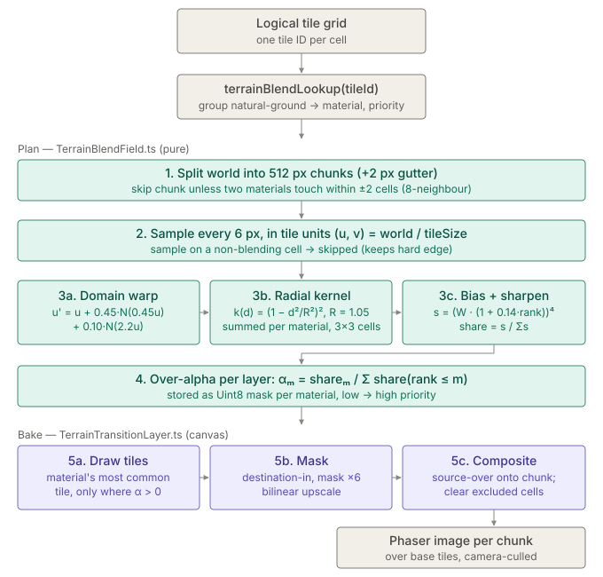

# Terrain Blend Math

How the organic ground merge described in [TERRAIN_TRANSITIONS.md](TERRAIN_TRANSITIONS.md) is computed. It is a presentation-only pass: the map keeps one logical tile per cell, physics and walkability use that cell, and blended images are painted over chunks where materials meet.

- Math (pure, no Phaser): [`features/world/TerrainBlendField.ts`](../../../src/game/features/world/TerrainBlendField.ts)
- Canvas bake: [`features/world/TerrainTransitionLayer.ts`](../../../src/game/features/world/TerrainTransitionLayer.ts)
- Interactive playground: open [`terrain-blend/playground.html`](terrain-blend/playground.html) directly in a browser (no build). Hover a pixel to see every intermediate value; the sliders change the constants below.

In one line: every sample point runs a **domain-warped, kernel-smoothed vote between neighbouring cells**, with a bonus for higher-priority materials, and each material's texture is painted through its own alpha mask.



## Inputs

A tile participates only if its TileSet `transition` metadata has `group: "natural-ground"` plus a `material` and `priority` (`terrainBlendLookup` in `TerrainTransitionRenderer.ts`). Current priorities: `deep-water` 4, `water` 5, most ground 10, some 12 and 20. Tiles sharing a material (`grass-a` / `grass-b` → `highland`) never form a border.

## Per-sample formulas

Samples are taken every 6 world pixels (`DEFAULT_SAMPLE_STEP`) and measured in tile units `(u, v) = world / tileSize`. A sample whose own cell does not blend is skipped, so that cell keeps its hard edge.

### 1. Domain warp

Before looking at neighbours the sample is displaced by two octaves of value noise, so borders wander instead of following the grid:

```
u' = u + 0.45 · N(0.45u, 0.45v)       + 0.10 · N(2.2u, 2.2v)
v' = v + 0.45 · N'(0.45u, 0.45v)      + 0.10 · N'(2.2u, 2.2v)
```

`N` is smoothstep-interpolated value noise in [-1, 1] over an integer hash seeded by the layer's `seed` (different seed offsets per axis and octave). The result is deterministic: the same map always produces the same borders and nothing is saved. Constants: `WARP_COARSE`, `WARP_FINE`.

### 2. Radial kernel vote

Each of the 3×3 cells around the warped point adds a weight to its own material, based on the distance `d` from the cell centre:

```
k(d) = (1 − d² / R²)²    if d < R, else 0        R = 1.05 tiles (KERNEL_RADIUS)
W_m  = Σ k(d_cell)       over the 3×3 cells whose material is m
```

`R` is chosen just above `1/√2 ≈ 0.707`, so a lone cell's corners fall within reach of its neighbours. Convex corners and single cells therefore round off, while a straight border between two equal regions stays on the cell edge (both sides vote symmetrically).

### 3. Priority bias and sharpening

```
s_m     = ( W_m · (1 + 0.14 · rank_m) )⁴        PRIORITY_BIAS = 0.14, SHARPNESS = 4
share_m = s_m / Σ_j s_j
```

- `rank_m` is the material's index after sorting the chunk's materials by ascending `priority` (ties by name). Each rank adds 14 % weight, which nudges borders into the lower material.
- The exponent turns a soft average into a fairly crisp border: `k = 1` gives a wide muddy gradient, large `k` approaches a hard edge.
- If the warp pushed the sample beyond every blend cell (`Σ s = 0`), the share falls back to 1 for the sample's own material.

### 4. Shares to "over" alphas

Layers are painted in ascending priority with normal source-over compositing. For the stack to reproduce the weighted mix `Σ share_m · colour_m`, each layer's alpha must be:

```
α_m = share_m / Σ_{j ≤ m} share_j
```

The lowest layer present is fully opaque, and each higher layer covers only its share of what is beneath. Alphas are stored as bytes (`× 255`) in one `Uint8ClampedArray` mask per material.

## Chunks and baking

1. **Chunk culling** — the world is split into 512 px chunks with a 2 px gutter (`TERRAIN_CHUNK_SIZE`, `TERRAIN_CHUNK_GUTTER`). A chunk is planned only if two different materials are 8-neighbours within 2 cells of it (kernel plus warp reach). Single-material chunks keep the plain tile layer.
2. **Draw tiles** — for each material layer, its most common tile near the chunk is drawn into every cell where that layer's alpha is non-zero (padded one sample step for bilinear spread).
3. **Mask** — the alpha mask (one pixel per sample) is drawn with `destination-in`, upscaled ×6 with image smoothing; the bilinear filter softens edges between samples.
4. **Composite** — the masked layer is drawn source-over onto the chunk canvas. Afterwards non-blending cells (`rock-wall`, `wood-floor`, `mushroom-*`) are cleared so their base tile shows through with hard edges.
5. **Display** — each chunk canvas becomes one Phaser image at depth `ground-decals + 0.2`, following the tile layer's origin and culled when outside the camera.

## Using the playground

- **Sharpness → 1** shows why the exponent exists: borders turn into wide gradients.
- **Warp → 0** gives perfectly symmetric, rounded, grid-aligned borders.
- **Priority bias ↑** lets snow and grass eat into water.
- **Kernel R ↓ toward 0.707** stops lone cells from rounding off.

The playground samples every 4 px without bilinear upscaling and always treats all four demo materials as present (rank = array index). Otherwise it uses the same hash, noise, kernel, and compositing as `TerrainBlendField.ts`. Keep it in sync when those constants or formulas change.
