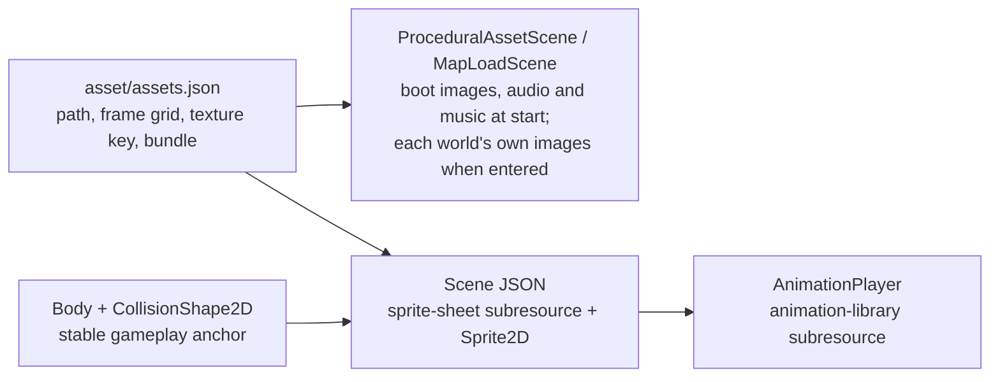

# Character sprites and animated visuals

How a registered sprite sheet becomes an animated player, NPC, enemy, weapon,
effect, or object. Rendering is kept separate from gameplay physics.

## Pipeline



Every animated thing is a scene under `src/game/content/scenes/authored/`
(`characters/`, `weapons/`, `effects/`, `projectiles/`, `objects/`). Edit it in
Scene Studio (`?studio=scenes`); the animation dock there is the only animation
editor. The former Character, Weapon, Projectile, and Animation Studios and the
shared `content/animations` packages were retired; old `?studio=characters`-style
URLs redirect to Scene Studio.

## Anatomy of a character scene

`characters/player-slime.scene.json`, trimmed:

| Node | Type | Role |
| --- | --- | --- |
| `body` | `CharacterBody2D` | Physics anchor; world position and velocity |
| `body-shape` | `CollisionShape2D` | Movement collider (`collision-shape` subresource, e.g. `30 x 26` rectangle) |
| `visual` | `Sprite2D` | `texture` → `sprite-sheet` subresource (`assetId`, `frameWidth`, `frameHeight`), `frame`, `origin`, `scale`, `position` |
| `damage-area`, `attack-area` | `Area2D` + shape | Hurt/hit sensors |
| `animation` | `AnimationPlayer` | `library` → `animation-library` subresource, `autoplay` clip |
| `script` | `ScriptNode` | `game.player`, `game.npc`, `game.enemy`, ... plus node references and data |
| `sfx-*` | `AudioStreamPlayer(2D)` | Cues wired by signal connections |

An `animation-library` maps clip names to `durationSeconds`,
`framesPerSecond`, `loop`, and `tracks`. The usual track binds `../Visual`
property `frame` to keyed sheet frame indices:

```json
"walk": { "durationSeconds": 0.8, "framesPerSecond": 10, "loop": true,
  "tracks": [{ "binding": "../Visual", "property": "frame",
    "keys": [{ "at": 0, "value": 9 }, { "at": 1, "value": 10 }, { "at": 2, "value": 11 }] }] }
```

Tracks can also animate other properties, be disabled, or use nearest
interpolation; keys may carry an easing `transition`.

Directional characters use one clip per direction (`idle-side`, `walk-up`,
`attack-down`, ... for worms; `walk-left`/`walk-right` for NPCs). Side art that
faces one way is mirrored at runtime with `flipX`; the player slime is drawn
facing left and flipped when moving right.

## Visual offset and scale

The body is measured in world units; frame changes never resize or move it.
The sprite's `scale`, `origin`, `position`, and `visualOffset` only move the art
around that anchor. Fix art alignment on the `Sprite2D`, and fix gameplay
footprint on the collision shapes, never the other way round.

## Gameplay data

Character packages in `src/game/content/characters/<id>/` (`character.json`,
`visual-set.json`) still supply runtime gameplay data such as enemy stats, NPC
wander settings, and the player package through `CharacterCatalog`, and are
validated by `pnpm characters:check` and `pnpm visuals:check`. They are not
edited through a studio.

## Adding another animated thing

1. Export a uniform-grid PNG ([sheet rules](../../../assets/asset-sheet-spec.md)) and register
   it in `asset/assets.json` ([Adding Game Assets](adding-assets.md)).
2. In Scene Studio, duplicate a similar scene (for example an existing NPC or
   worm) or create one, then point its `sprite-sheet` subresource at the new
   `assetId` with the matching frame size.
3. Author clips in the animation dock, set the sprite scale/origin, and size the
   body and sensor shapes.
4. Place an instance in a world scene.
5. Run `pnpm assets:check`, `pnpm scenes:check`, and the relevant content check,
   then smoke-test playback and collision in game.
