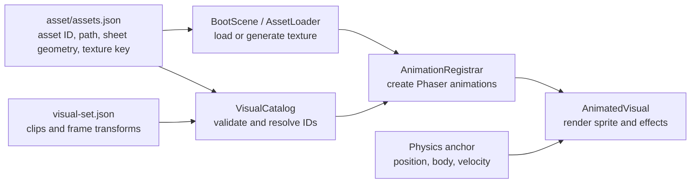
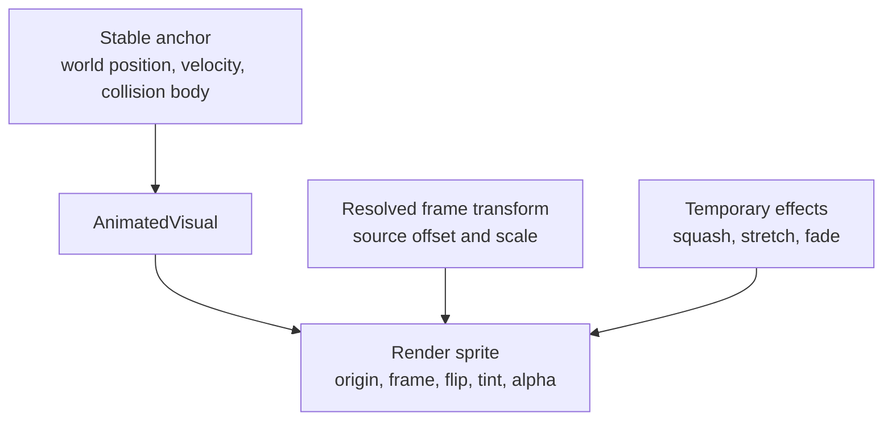

# Character sprites and animated visuals

This guide explains how file-backed and procedural art becomes a player, enemy, or world-object visual. The implementation deliberately separates rendering from gameplay physics.

## Workflow



`asset/assets.json` owns media-loading facts. A visual set in `src/game/content/visuals/<name>/visual-set.json` owns how that media is rendered:

- default origin, scale, and source-frame offset;
- optional per-frame transform overrides;
- named clips, frame order, timing, repeat behavior, and stable runtime keys.

Gameplay facts such as collision, health, movement, AI, and damage remain in TypeScript content or their owning feature.

## Why `slime` is no longer hardcoded

The old animation helper always generated frames from the Phaser texture key `slime`. Idle and walk differed only because their clip definitions selected different frame sequences. This worked for one player texture, but it could not safely describe trees, enemies, or another player skin.

The replacement resolves a visual set through its stable manifest `assetId`. `AnimationRegistrar` obtains the associated texture key and registers every clip. Callers use a stable visual-set ID and clip ID, for example:

```ts
visual.play("walk");
```

They do not need to know the image path, Phaser texture key, or sheet layout.

## Visual offset and scale

Every animated entity has a stable gameplay anchor and a separate render sprite:



The physics anchor is measured in world units. Frame changes never resize or reposition its body.

`sourceOffset` is stored in source-art pixels. For each displayed frame:

1. Start with the visual-set defaults.
2. Replace any properties supplied by that frame's override.
3. Compute render scale as `frame scale × temporary effect scale`.
4. Compute render offset as `sourceOffset × resolved scale × temporary effect scale`.
5. Mirror the horizontal offset when the visual faces left.
6. Place the render sprite at `anchor position + render offset`.

This keeps art correction close to the animation data while preserving stable collision. The current slime file supports per-frame overrides but does not invent corrections for frames that have not been artist-reviewed.

## One-frame animations

The same model handles static-looking art. The blob enemy and selected tree each use a looping one-frame clip. For an image or procedural texture, frame `0` means the texture's base frame. For a spritesheet, the number addresses that sheet's source frame.

This gives trees and enemies the same API now and allows their JSON clips to gain additional frames later without rewriting entity behavior.

## Runtime object patterns

### Player: factory plus controller

`PlayerFactory` creates an invisible Arcade physics anchor, an `AnimatedVisual`, and the name tag. `PlayerController` controls velocity, facing, and clip selection. `AbilitySystem` applies temporary squash, stretch, and alpha effects to the visual while movement and collision remain on the anchor.

Use this pattern for a character coordinated by several feature systems.

### Enemy: Phaser subclass with a composed visual

`Enemy` remains an Arcade Sprite so existing AI and collision code continue to use it as the anchor. Configured enemy types compose an `AnimatedVisual`; legacy types can still render the anchor's original texture.

Use this migration pattern when a Phaser subclass already owns substantial gameplay behavior.

### World object: factory-selected visual path

`ObjectFactory` keeps ordinary objects as lightweight images. An object visual that declares both `visualSetId` and `animationClip` receives a stable anchor plus `AnimatedVisual`. Authored collision and map position remain attached to the anchor.

The current map editor deliberately uses its static image path. A future visual-set editor can edit the JSON source and preview clips without changing map files; maps should continue to store stable object/archetype IDs.

### Composite object: plain wrapper

`House` is a plain class that owns several Phaser images and interaction zones. This remains useful when one gameplay concept contains several independently positioned objects and does not need frame animation.

## Adding another animated thing

1. Add or confirm its stable entry in `asset/assets.json`.
2. Add `src/game/content/visuals/<name>/visual-set.json`.
3. Define defaults, optional frame overrides, and one or more clips.
4. Reference its `visualSetId` and default clip from the owning player, enemy, or object definition.
5. Keep collision and gameplay values outside the visual-set JSON.
6. Run `pnpm assets:check`, `pnpm visuals:check`, the relevant content checks, and `pnpm build`.
7. Smoke-test playback, effects, collision alignment, and cleanup during scene transitions.

## Important files

- [`asset/assets.json`](../../asset/assets.json) — media paths, texture keys, sheet geometry, and bundles.
- [`src/game/content/visuals/visual-set.schema.json`](../../src/game/content/visuals/visual-set.schema.json) — editor-friendly JSON contract.
- [`src/game/content/visuals/VisualCatalog.ts`](../../src/game/content/visuals/VisualCatalog.ts) — typed loading, validation, and transform resolution.
- [`src/game/features/visuals/AnimationRegistrar.ts`](../../src/game/features/visuals/AnimationRegistrar.ts) — generic Phaser animation registration.
- [`src/game/features/visuals/AnimatedVisual.ts`](../../src/game/features/visuals/AnimatedVisual.ts) — render sprite, frame transforms, playback, effects, and cleanup.
- [`src/game/content/visuals/player-slime/visual-set.json`](../../src/game/content/visuals/player-slime/visual-set.json) — migrated slime clips and visual defaults.
- [`src/game/content/visuals/enemy-blob/visual-set.json`](../../src/game/content/visuals/enemy-blob/visual-set.json) — procedural one-frame enemy example.
- [`src/game/content/visuals/tree-world/visual-set.json`](../../src/game/content/visuals/tree-world/visual-set.json) — one-frame authored tree example.
- [`src/game/features/player/PlayerFactory.ts`](../../src/game/features/player/PlayerFactory.ts) — player anchor and visual composition.
- [`src/game/enemies/Enemy.ts`](../../src/game/enemies/Enemy.ts) — enemy integration and visual effects.
- [`src/game/features/objects/ObjectFactory.ts`](../../src/game/features/objects/ObjectFactory.ts) — static versus animated object creation.
- [`scripts/check-visuals.mjs`](../../scripts/check-visuals.mjs) — repository-level visual content validation.
