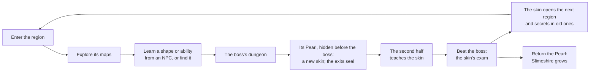

# Direction

The game's backbone: what the game is, where the slime's powers come from, and
how a region plays. The dated decisions behind it are in [History](#history).
Story details are in [Premise](./02-premise.md); every permanent item and where
it is earned is in the [Unlock map](./05-unlock-map.md).

> **Status words.** *Built* is in the game. *Rework* is built in the **rework
> mode** (merged 2026-10-15): on in the playground, and in any world with
> `?shapes`; with it off the classic game runs unchanged
> ([BODY_SHAPES.md](../godot/BODY_SHAPES.md)). Once the three skins are built,
> the rework becomes the only game (owner, 2026-10-15). *Planned* is decided
> but not built. *Open* is not decided.

## The game in one line

Slime Isa is a top-down adventure in the spirit of Zelda. Gorge broke the
Wellspring's heart, the source of every new slime, into eight Pearls and gave
them to his eight vassals. The last slime born explores a growing world, wins
the Pearls back from those bosses (each hides his Pearl in his dungeon, where
the slime finds it before facing him: owner, 2026-10-17) and, with them, the
powers that open new places. A short prologue opens the game: the slime is born
at the Wellspring,
learns to move and to gulp, saves the veteran Yoi from the worms and learns
the Spear from him (Planned, owner, 2026-10-16,
[prologue](../design/2026-10-16-prologue.md)). Crafting stays, but it is small, and it is not a survival game ("the
adventure version, with a little bit of crafting", owner, 2026-10-02). In
Release 1 it makes only potions and food, "maybe the vault", and nothing is
harvested (owner, 2026-10-15). Their ingredients are picked up or dropped, and
the vault waits for a later release (owner, 2026-10-16).

## The rule behind every chapter

> **Permanent things are earned and celebrated. Consumable things are crafted
> and farmed.**

| Permanent: earned once, kept forever, celebrated | Consumable: crafted or farmed, used up |
|---|---|
| Skins (from the Pearls) | Potions and food |
| Shapes (spear, axe, hammer, ...) | Energy shards |
| Abilities (Roll, Stretch Lash, Bomb, ...) | Charcoal, iron bars and other materials (none in Release 1, which has no harvesting) |
| Evolutions of shapes and abilities (after Release 1) | Anything that stacks in the bag |
| Bags and vaults | |
| Heart quarters and energy upgrades | |
| Keys and story items (Pearls, manuscripts) | |

Earning any permanent thing is a moment: the game pauses, the item rises out of
the slime with light rays and a fanfare, and a card shows its name, one line of
text and how to use it.

## Each thing is told apart

> **Each thing must be told apart. Different things never look alike, and
> options are sacrificed for clarity** (owner, 2026-10-16,
> [question 77](07-decisions-archive.md#contradictions-left-after-the-review-2026-10-15)).

- Each lock has one power and a look of its own, by what the thing is
  (owner, 2026-10-16, questions 92 and 93):
  - **the War Axe:** living, green things: trees in leaf, bushes, leafy
    vines, webs, tethers;
  - **the Heavy Roll:** old dead or built things that lie or lean in the
    way: grey leaning old trees, rotten trunks across a path, old fences,
    plank barricades, rotten mine timbers, loose rocks, rubble heaps. A Heavy
    Roll knocks the grey, leaning old tree over the river as a bridge
    (question 101);
  - **the Lantern:** dry plant growth (deadthorn, hay, dry roots, old
    banners), and the wood a Heavy Roll knocked down once it lies there;
  - **the Hammer:** big single boulders (question 77);
  - **the Spear:** a lever behind bars, which only a thrust reaches ("through
    bars"), first met at the prologue's gate (question 97). *Changed
    2026-10-16 (seventh round, question 114): Spear-only bells come back
    across the world as a second kind of Spear lock: a bell on an islet, or
    behind a gap, that a thrown pot cannot ring but the Spear's reach can.*
    *Changed 2026-10-16 (eighth round): no bell is the Spear's (question
    115, below). Bars stop arrows, so a lever behind bars stays the Spear's
    alone (question 131), and an eye is always the Spear's, or an enemy's
    (question 127).*
  - **bells** (owner, 2026-10-16, eighth round, question 115): a ranged
    lock. A thrown pot or an arrow rings a bell, which gives the Bow more to
    do; the Spear and the Stretch Lash never do, and the Lash's posts are
    posts it pulls on, not bells. The 2026-10-11 plan's alarm bells and
    gongs become wooden clappers a pot sets off (question 127). *Changed in
    the tenth round: the wooden clappers are the worm army's alarms:
    anything that hits one (a pot, an arrow, a Spear jab, the slime bumping
    it) sets it off and calls the nearby camp, a trap to avoid or use, never
    a lock.* What a bell
    opens stays open for good, so a bell is a lock solved once (ninth round,
    [question 136](07-decisions-archive.md#open-after-the-eighth-round-2026-10-16));
  - **the Bow:** far targets, each a crystal lens on a post, never an eye
    (question 127).

  So the three woods have three looks: the Axe's are alive and green, the
  Roll's are old, grey and dead, and the Lantern's are dry growth.
- **Looks** (owner, 2026-10-16, eighth round, questions 128 to 130):
  - what the Gulp lifts is small and sits loose, with the Gulp's prompt in
    reach; what the Heavy Roll breaks is big, grey and old and lies or leans
    across the way. The heap at Yoi's home is crates;
  - the Heavy Roll's leaning tree is always a placed object, never painted
    on the forest layer; an old breakable fence is grey and broken-backed
    and never stands on a rim; the Hammer's boulders carry a crack mark that
    scenery boulders never have;
  - Feral's roots are thick, living and leafy beside rocky handholds, the
    Lantern's dry roots grey-black and thorny, and the root-rock wall style
    never stands next to a climbable wall;
  - only grey-black, scorched hay and banners burn; the gold haystacks and
    bright banners are scenery;
  - Tom's cocoon hangs by a thread with his face showing, a silk-wrapped
    prize is a small flat parcel that glints, and the Cocoon Mimic breathes;
  - every Release 1 border is a Thorn Guard post: a striped barrier with a
    guard who says what lies beyond is closed for now. No landslides or
    fallen bridges as borders.
- A climbable wall shows thick roots and rocky handholds on the cliff face;
  the Axe's vines are leafy curtains hanging in front of an opening
  (question 86).
- A climbable wall and a heavy block never stand side by side. Held W next to
  both does whichever the slime faces (question 91).
- When a new thing would look like another, it changes or it goes.
- The War Axe waits for the next release (question 94), so in Release 1 its
  locks are come-back secrets. Its living-tree bridge, a tree cut to fall
  over the water, may come back with it (question 101).

## The slime's powers

The slime has three kinds of power. Each has one source and one job.

| System | What it is | Where it comes from | Its job | Energy |
|---|---|---|---|---|
| **Skins** | A Pearl's power that becomes part of the slime: always on once learned, with no key. Each has its gate and a change to a move the slime already has ([The skins](#the-skins)). | One per **Pearl**: each of the eight bosses hides one in his dungeon, where the slime finds it before him (owner, 2026-10-17) | Open the next region, reach secrets in old ones, and beat later bosses | Free |
| **Shapes** | The slime shapes itself into a weapon or tool: spear, axe, hammer, ... They replace crafted weapons. Each has a combo chain and a hold-to-charge attack. | **NPCs** teach them, or **old manuscripts** the slime finds, whole or in pieces. In Release 1 NPCs teach and chests hold the finds; manuscript pieces come later. *Since 2026-10-16: Release 1 has whole manuscripts, each found in a chest as one find (question 65); what they teach is question 108 (Open)* *Answered 2026-10-16 (seventh round, question 108): Release 1's manuscripts teach campfire recipes (potions and food) and lore, pages of the Thorn Guard's war journal that tell the war's story bit by bit. Manuscripts that teach powers start in the next release* | Fight and break (no chopping or mining: Release 1 has no harvesting) | Free; a charged attack costs energy |
| **Abilities** | Moves the slime uses at will: Roll, Stretch Lash, Goo Bomb, Lantern, ... All but the Roll share one key: the player picks which one it fires in the bag (the Ability Box), and the game pauses while the bag is open. The main path never needs a combo; a few optional secrets may combine a skin and an ability, each clearly different ([The skins](#the-skins); owner, 2026-10-16, question 84). | **NPCs** (taught, or rescued) and **manuscripts**; in Release 1 NPCs and chests, as for shapes. *Since 2026-10-16 (seventh round, question 108): every Release 1 ability comes from an NPC; manuscripts teach powers from the next release* | Movement, puzzles and the tools a boss needs | Every use costs energy; the quick Roll is free |

- **The Slime Forge** (a new building) evolves shapes and abilities. The slime
  stays at the Forge while it evolves, and it ends in the full ceremony.
  Evolutions come after Release 1 ("upgrades of skins and abilities come
  later in the game", owner, 2026-10-15). Skins do not evolve: only shapes
  and abilities do, and all of it comes after Release 1 (owner, 2026-10-16,
  question 67).
- **The Gulp** only grabs light objects (pots and the like, never a live enemy)
  and throws them.
- **Energy refills slowly by itself**, 1 a second ("energy can recover but
  really slow, like 1 per second; in addition we will add more ways to
  recover energy", owner, 2026-10-15). Potions and energy shards bring back
  more (a kill drops a shard now and then), so the player still chooses when a
  power is worth it. Planned:
  - refills that grow back (energy flowers or pots) through the world and in
    the dungeons' rooms, but not inside a boss chamber unless the boss makes
    minions the slime kills;
  - a full refill from beds, the Wellspring and Slimeshire's well once
    Pearl 1 restores it (a drink in town), and beds also restore life
    (owner, 2026-10-16, questions 62 and 105). There are no save points:
    like Zelda, the slime saves everywhere except inside dungeons
    (question 62). *Until 2026-10-16 the plan said "a full refill at the
    Wellspring and at save points".* *Since 2026-10-16 (seventh round,
    question 113): the well's refill grows back: it refills again after a
    while, so it is not used up.*
  - the quick Roll stays free, and no puzzle costs more than the starting max
    energy;
  - before more is built, one chapter's route is played and its energy
    counted;
  - enemies and grass drop energy and health refills, and sometimes coins,
    like Zelda's magic jars (owner, 2026-10-16, question 24). Grass is cut by
    the Spear and, later, the War Axe, and grass tufts never look like the
    Axe's bushes (the tenth round);
  - spending pauses the refill for about a second, tuned in play (owner,
    2026-10-16, question 20).

  Max energy grows over the game: potions, the well and defeating a boss
  raise it (owner, 2026-10-16, question 19). Basic attacks stay free, so the
  slime is never helpless, the tiny cooldowns stay as an anti-spam guard,
  and rolling is free, with no minimum to start (questions 21 to 23).

### The skins

Like Zelda's flippers and gloves or Super Metroid's suits, a skin is never put
on or switched: once the Pearl is won, its power is part of the slime for good
(owner, 2026-10-15). The rules:

- **Contextual.** A skin acts in its own places and on its own move: its gate
  (a heavy plate, a web wall, a wall to climb) and one change to a move the
  slime already has (owner, 2026-10-15). It shows while it works: the slime
  turns stony as it grabs a block or stands on a plate, silky in a web, and
  shows claws as it climbs. The rest of the time the slime looks and moves as
  itself.
- **Pure additions.** A skin never has a downside (Heavy does not slow the
  slime down) and never clashes with another: each answers its own kind of
  place (webs, plates, walls to climb, water, lava, ...), so all of them stack.
- **No keys.** The controls stay attack, shape, mouth, ability, roll and
  interact, whatever the slime has learned. The Feral skin climbs with a held
  interact.
- **Gated by region.** Each region's places need its own skin, as Zelda gates
  with items, so having every skin on does not make later regions easy; their
  challenge is in fights and energy.
- **A look of one's own.** The player may pick a learned skin as the slime's
  everyday look (cosmetic only).

No ability is locked to a skin. The "depth from combos" rule (skins combined
with shapes and abilities) was dropped in the review of 2026-10-15 ("depth
from combos makes no sense to me, remove that", owner). *Open since
2026-10-16: the owner wants a few combos used wisely, such as a Heavy Roll
that knocks an old tree down into dry wood the Lantern burns ("we should not
abuse combos, but used wisely they bring more depth to the game"); how that
sits with this rule is question 84.* *Answered 2026-10-16 (owner, question
84): the main path never needs a combo. A few optional secrets may combine a
skin and an ability, and each looks clearly different. For example, a Heavy
Roll knocks down a grey, leafless, leaning old tree, made of old material the
Axe cannot cut, and the Lantern burns it once it lies there as dry wood.*

Why always on: no switching key or skin-ability key, no wrong-skin mistakes
that waste energy, and backtracking that just works. What it could cost, and
the rule that answers it:

| Risk of always-on skins | Answered by |
|---|---|
| Skins lose their trade-offs (the old Stone form was slow) | Contextual: a skin acts only in its own places and on its own move, so it never slows or limits the slime elsewhere |
| Skins clash when all are on (Heavy sinks, Cloud floats) | Pure additions: each answers its own kind of place, so they stack like Super Metroid's suits |
| Power creep late in the game | Gated by region: each region's places need its own skin; challenge stays in fights and energy |
| The transformation fantasy fades | A skin shows while it works, and the player can pick one as the everyday look |

The first three skins are Release 1's (owner, 2026-10-15), and the other five
come in later releases, one from each of the other vassals (owner, 2026-10-16,
[question 32](07-decisions-archive.md#skins-shapes-and-abilities-2026-10-15)):

| Skin | Pearl | Its gate | Its change to a move | Status |
|---|---|---|---|---|
| **Heavy** | 1, Fatty One Eye | Sinks the heavy plates, and moves statues, pedestals and blocks | A Roll that hits a wall, a tree and so on shakes things loose, so objects fall, and it breaks the small loose things lying in its way: a loose rock, a rubble heap, a rotten trunk across a path (owner, 2026-10-16, question 77). It also knocks down or breaks the old dead or built things that lie or lean in the way: grey leaning old trees, old fences, plank barricades, rotten mine timbers (owner, 2026-10-16, question 93). It knocks the grey, leaning old tree over the river as a bridge (owner, 2026-10-16, question 101). Its screen shake is strong; without the Heavy skin a Roll's bonk shakes much less (owner, 2026-10-16). It does not push enemies away: that is a later upgrade from another skin. Its first lock is Fatty's Lair's way out (owner, 2026-10-16, question 132). *Changed 2026-10-17: Pearl 1 is found in Fatty's Lair before him, the lair's second half teaches the skin, and his fight is its exam ([History](#history))* | Built 2026-10-17 ([SKINS.md](../godot/SKINS.md#heavy)): heavy plates and blocks, the Heavy Roll's strong shake and its breakables (plank barricades, rotten timbers, rubble heaps, loose rocks, old trunks and fences) and the prize it shakes loose. Not built: the grey leaning old tree and its river bridge |
| **Silk** | 2, the Matron | Passes web walls at −50% speed, and webs no longer slow it or stick a Roll (owner, 2026-10-16, question 131). A maze of web walls leads to the Crystal Caverns, so the skin opens Chapter 3 (owner, 2026-10-16, question 81). From the Wilds a second web maze leads into Gloop Forest, and only the Silk skin passes it (owner, 2026-10-16, question 87) | The shapes cut webs, which they cannot do before the Silk skin. In Release 1 that is the Spear, the only shape (owner, 2026-10-16, question 94). *Changed 2026-10-17: Pearl 2 is found in the Weaver Hollow before the Matron, the dungeon's second half teaches the skin, and her fight is its exam* | Built 2026-10-17 ([SKINS.md](../godot/SKINS.md#silk); the webs: [WEBS.md](../godot/WEBS.md)) |
| **Feral** | 3, the Crystal Colossus | Climbs some walls it could not climb before, which opens the world. A climbable wall looks different from the others: thick roots and rocky handholds on the cliff face (owner, 2026-10-16, questions 68 and 86; first described as vines and irregularities), while the Axe's vines are leafy curtains hanging in front of an opening. The player holds W (interact) to climb, claws show, and the slime climbs up and down; letting go midway drops it, and a fall costs nothing (owner, 2026-10-16, [question 68](07-decisions-archive.md#contradictions-left-after-the-review-2026-10-15)). A climbable wall never stands beside a heavy block, and held W next to both does whichever the slime faces (question 91). From the Wilds a hill that only the Feral skin climbs leads into the Crystal Caverns, so that way opens once Feral is won (question 87). Its first lock is the climb out of the Colossus's arena, then the Wilds (question 132). *Changed 2026-10-17: Pearl 3 is found in the Crystal Caverns before the Colossus, the caverns' second half teaches the skin, and his fight is its exam* | The Spear's attacks hit twice as fast | Built 2026-10-17 ([SKINS.md](../godot/SKINS.md#feral)): the held climb up and down, the free drop, the claws, the Spear at twice the tempo (owner, 2026-10-16, question 56). The Colossus shows the Pearl's power in his fight: he climbs out of reach and throws minions down (question 69). Swim was Pearl 3's skin until 2026-10-16: it does not fit the Colossus (owner) |
| **Swim** | Later: Old Gullet, the catfish (Sticky Swamp), who swallows whatever falls in and hides in deep mud and water | Deep water: the deep-water secrets are come-back secrets that wait for it (owner, 2026-10-16) | Open | Planned for a later release (owner, 2026-10-16, question 32; Swim left Pearl 3 on 2026-10-16, question 56). Today the Swim form, from a swim essence, crosses deep water. The essence goes, but the Swim form is not dropped: its scene mechanics are refactored into a permanent power that works in deep water, this skin (owner, 2026-10-16, question 75) |
| **Polar** | Later: Old Rimepaw, the polar bear (a working name; Frostpeak), who slides across the frozen lake on his belly and cracks the floes with a slam; his arena's ice makes the slime slip until it learns to read his slides | Sure-footed, and cold no longer hurts. Without it the slime slips on ice and cannot change direction, which closes many places and secrets; with it, ice and every slippery surface (oil and others, in other maps too, that keep the slime from reaching the far side of a path) are walked without trouble | On ice the Roll becomes a **belly slide** like a polar bear's: long, fast and steerable, across frozen lakes and through ice-race secrets | Planned for a later release (owner, 2026-10-16, question 32; first named the Frost skin). Its look: a white, fluffy coat with a blue tint, and padded paws that show on ice |
| **Sand** | Later: Sandmaw, the great sand worm (the Desert), Gorge's worm general, who burrows under the dunes and bursts out | Digs into soft sand and passes under sand walls and through quicksand, like a Popworm | Open | Planned for a later release (question 32) |
| **Cloud** | Later: Gale, the storm roc (the Northern ruins), which flies over the ruin maze and blows gusts | Puffs up light, floats across gaps from a ledge and rides updrafts | Open | Planned for a later release (question 32) |
| **Lava** | Later: Cinder, the magma salamander (Volcano Ridge's slopes), who swims in lava and spits fire | Walks on lava and through fire. The last skin: it opens the way into Gorge's crater | Open | Planned for a later release (question 32) |

The later regions' order is still
[question 10](06-open-questions.md#story). **Gorge**, in the crater, is the
ninth and final boss, with no skin, and the Pearls go home. The acid skin is
kept as a spare (it would melt rusted bars and metal grates) in case one of
these is replaced (question 32).

### Webs (Chapter 2)

| | Webs | Web walls |
|---|---|---|
| **Without the Silk skin** | Speed −50% | Cannot pass |
| **With the Silk skin** | Full speed | Pass at −50% speed |

- The shapes cut webs only once the Silk skin is learned, so the player has to
  deal with the webs to defeat the Matron (owner, 2026-10-15). With the skin, a
  cut opens a web wall for good and frees things wrapped in silk: a chest, a
  key, a trapped slime (owner, 2026-10-16, question 55). Tom hangs in a
  cocoon, which a weapon tears before the skin (owner, 2026-10-16,
  question 54). In Release 1 the Spear, the only shape, does both
  (question 94). *Since 2026-10-16 (question 95): the maze that leads to Tom
  has webs that slow the slime and cannot be cut before the Silk skin.*
- **A Roll sticks in a floor web** (owner, 2026-10-16, eighth round,
  question 131): walking through one slows the slime until the Silk skin, and
  web walls block until the Silk skin. So the Slime Spider's right tool is the
  Silk skin: with it, its webs no longer stick.
- The War Axe, in the next release, cuts webs without the Silk skin; the
  Silk rule is for the Spear (question 135).
- The Matron's fight is played with the slowdown before the number is fixed.

No web wall blocks the way to the Matron. The slime meets her without the Silk
skin, so her web attacks hit it with their full effect. Her Pearl grants the
Silk skin, which then opens the web walls all over the forest and in the maps
already visited. It also opens Chapter 3, as a skin opens the next region: the
way to the Crystal Caverns is a maze of web walls that only the Silk skin
passes (owner, 2026-10-16, question 81). From the Wilds a second web maze
leads into Gloop Forest, and only the Silk skin passes it (owner, 2026-10-16,
question 87). *Changed 2026-10-17: Pearl 2 is found inside the Weaver Hollow,
before the Matron, so the slime meets her with the Silk skin: the Hollow's
second half teaches it, and her fight is its exam. How her webs and her fight
change goes with the dungeon's rework
([the plan](../design/2026-10-17-pearl-mid-dungeon.md)).*

## How a region plays

```mermaid
flowchart LR
  A[Enter the region] --> B[Explore its maps]
  B --> C[Learn a shape or ability<br/>from an NPC, or find it]
  C --> D[The boss's dungeon]
  D --> E[Its Pearl, hidden before the boss:<br/>a new skin; the exits seal]
  E --> F[The second half<br/>teaches the skin]
  F --> I[Beat the boss:<br/>the skin's exam]
  I --> G[The skin opens the next region<br/>and secrets in old ones]
  I --> H[Return the Pearl:<br/>Slimeshire grows]
  G --> A
```

**The tool you find and the skin of the Pearl inside the dungeon beat the
boss; the skin opens the world.** *Until 2026-10-17 the boss gave the
Pearl: "the tool you find beats the boss; the skin the boss gives opens the
world". Since then the Pearl is found inside the dungeon, before the boss,
and the boss fight is the skin's exam (owner, 2026-10-17).*

## How it borrows from Zelda

- **A big world.** Many regions, and each region can span several maps. A
  chapter can span several maps but stays within one region. Some maps have no
  boss; each region has exactly one, placed on whichever map suits the
  adventure (Fatty One Eye could move to his own cavern map, for example).
  Release 1 (Chapters 1 to 3, owner, 2026-10-15) is only the opening of that
  world.
- **Key tools per region.** Each region teaches one or more shapes or
  abilities, and its boss needs them.
- **One skin per boss**, always on once won. The skin opens the next region
  and secrets in places the player has already visited, which rewards going
  back. *Since 2026-10-17 the Pearl is the dungeon's item, as in Zelda: found
  inside the dungeon before its boss, it gives the skin that the dungeon's
  second half teaches and the boss fight tests.*
- **Bosses live in their dungeons.** Once the slime enters a boss's chamber it
  cannot leave until the boss is beaten. *Since 2026-10-17 taking the Pearl
  seals the dungeon's exits: from then on the only way out is to beat the
  boss.*
- **Growth through exploration.** Max health and max energy grow through
  secrets and bosses, never through levels: heart quarters and a full heart
  from each boss, and potions, the well and each boss for energy (owner,
  2026-10-16, questions 17 and 19).
- **Movement in order.** Basic moves come early and powerful ones later.
- **Secrets spread over the whole game.** They are not packed into the first
  maps.

## Decisions in effect

| Topic | Decision | The game today |
|---|---|---|
| **Release 1** | Chapters 1 to 3, with three skins: Heavy, Silk and Feral (Pearl 3, owner, 2026-10-16, question 56). The Swim skin waits until after Release 1, and the deep-water secrets are come-back secrets for it (owner, 2026-10-16). NPCs teach, and chests hold the finds. Manuscript pieces and Slime Forge evolutions wait ("upgrades of skins and abilities come later in the game"). Its content ends when the Crystal Colossus falls, but the game goes on: the player explores the first three chapters' regions, part of the West village and the Wilds that connect them with the new powers, and the game says that from here on it is exploration and that more areas come in later releases (owner, 2026-10-16, question 58). Barriers in the world close the ways to the other regions (a fallen bridge, a landslide, a Thorn Guard post), each saying that more lies beyond (owner, 2026-10-16, question 73); how long it plays is still to be measured. From the Wilds, the Crystal Caverns are reached up a hill that only the Feral skin climbs, and Gloop Forest through a second web maze that only the Silk skin passes (owner, 2026-10-16, question 87). **Its powers:** eight besides the Gulp, about three a chapter. Chapter 1: the Spear (Yoi), the Roll (young Burr) and the Heavy skin (Pearl 1). Chapter 2: the Goo Bomb, the chapter's key tool, and the Silk skin (Pearl 2). Chapter 3: the Lantern (the smith), the Feral skin (Pearl 3) and the Bow (Burr). The War Axe and Stretch Lash wait for the next release, and their locks become come-back secrets (owner, 2026-10-16, question 94). Where the Goo Bomb comes from is question 95, and Release 1 with one shape is question 96 (both Open). *Changed 2026-10-16 (sixth round): a short prologue comes before Chapter 1, where Yoi teaches the Spear (question 97); Tom teaches the Goo Bomb (question 95); the Spear is the only shape (question 96). Release 1 has whole manuscripts, each found in a chest as one find, and pieces come later (question 65); what they teach is question 108 (Open).* *Changed 2026-10-16 (seventh round, question 108): they teach campfire recipes and lore, the Thorn Guard's war journal; manuscripts that teach powers start in the next release.* *Changed 2026-10-16 (eighth round): every border is a Thorn Guard post, a striped barrier with a guard who says what lies beyond is closed for now, with no landslides or fallen bridges (question 130). Release 1 shows only a few War Axe, Stretch Lash, Hammer and Swim locks, each with a line that says it needs something not found yet, and every Release 1 heart quarter can be reached with Release 1's powers (question 135).* | Chapters 1 and 2 are built; the Crystal Caverns are a placeholder world, open without a key |
| **Prologue** | A short, closed opening before Chapter 1, like Zelda's and Super Metroid's (owner, 2026-10-16, question 97; the [prologue design](../design/2026-10-16-prologue.md), accepted as written). The slime is born at the Wellspring, learns to move and to gulp (it clears a blocked path), sees Yoi fall to four worms in a camera scene, saves him by throwing things (the prologue's worms die from one hit), and learns the Spear from him. A barred gate, the Spear's "through bars" lock, opens into Slimeshire, and at the town's edge Plop meets the slime, gives it the 10-slot bag and its first tips, with the exclamation mark, and later sends it to Burr (question 100). It sits between chunks B4 and C4 in the south; chunk content may move to fit it, or it can be an underground cavern. Its lake is **the Wellspring**: after the prologue a short forest path from Slimeshire's south-west reaches it, and each Pearl's homecoming is a short scene there (question 98). *Changed 2026-10-16 (seventh round): in B4 the prologue takes the south edge, sealed off by forest, and the West village's town sits in B4's north and A4; the forest path to the Wellspring leaves Slimeshire, not the town (question 112). The prologue cannot be saved, and the HUD appears right after the birth scene (question 113).* | Not built: a new game starts in Slimeshire's clearing, where Plop greets the slime and Slime Basics starts |
| **One game** | Once the three skins are built, the rework becomes the only game. The old system goes with all its code: the classic mode, Swallow, essences, the forms, crafted weapons and tools, harvesting, Squash Slam and the classic number-key abilities. Their art waits "until we are sure we don't need it" in `asset/to-delete/` at the repo root, outside the Godot project so it is no longer imported, each file keeping its relative path. The Swim form is not dropped: its scene mechanics are refactored into a permanent power that works in deep water, the later Swim skin; only its essence goes (owner, 2026-10-16, question 75). | Both run: the classic game, and the rework mode in the playground and with `?shapes` |
| **Quests** | Quests no longer make sense: NPCs give info and tips, perhaps with one main quest like Zelda's, winning back the eight Pearls (owner, 2026-10-15, question 50). The journal keeps one main quest, "Win back the Pearls", and a page of the tips NPCs give; its Pearl slots show empty and fill as the Pearls are won, each lighting up its part of a picture and saying what the Pearl does. An NPC hands over or teaches its find when the slime talks to it, and the other finds lie in chests, each with its ceremony. A building is restored when a Pearl comes home ("Return the Pearl: Slimeshire grows") (owner, 2026-10-16, question 60): Pearl 1 restores Slimeshire's well, which then refills energy (question 90), and Pearl 2 relights the Forge (question 79). With no quests, an NPC that has a tip that matters to the story shows the exclamation mark (owner, 2026-10-16, question 82). *Changed 2026-10-16 (sixth round): after Fatty, the freed Burr says the town must see the Pearl, the journal's main quest points home, and the well comes back when the slime brings the Pearl to it (question 103); each Pearl's homecoming is a short scene at the Wellspring (question 98).* *Changed 2026-10-16 (seventh round, question 110): every Pearl goes home to the Wellspring, which brightens, and its power flows into the town: the well comes back with Pearl 1, the Forge lights with Pearl 2. The slime does not take Pearl 1 to the well.* | Every chapter beat is a quest, with the journal, quest offers and rewards |
| **Getting an item** | The full ceremony for every permanent thing the first time; a smaller sting for new recipes; nothing for materials. | Built 2026-10-09 for abilities, permanent items and Goo Hearts (owner's playtest open); the recipe sting is not built |
| **Bags** | The slime starts with no bag. Release 1 has **one bag** (owner, 2026-10-16, question 53): Elder Plop's **10-slot bag**, and the 20-slot bag waits for the next release ("since we don't have many collectibles now", owner, 2026-10-16, question 74). What the Gloop Cavern's coffer holds instead is question 63 (*answered 2026-10-16: heart quarters, potions, coins or a piece of the story*). The 2026-10-02 plan had Plop give the 10-slot bag with the first quest and the 20-slot bag wait in that coffer, replacing it. *Changed 2026-10-16 (sixth round, question 100): Plop gives it at the town's edge, as the slime comes out of the forest after the prologue.* *Changed 2026-10-16 (eighth round, question 18): there is no Gloop Cavern, so there is no coffer.* *Changed again (tenth round, question 18): the small cave stays as a secret with one of Gloop Forest's heart quarters; its coffer stays gone.* | 20 slots from the start |
| **Vault** | Waits for a later release (owner, 2026-10-16, question 53). The plan for it: found inside a house during a quest that also teaches sleeping to recover; **50 slots**; the vault screen shows the bag on the left and the vault on the right, with drag and drop both ways. *Changed 2026-10-16 (eighth round, questions 11, 12 and 38, closed as answered before): Release 1 has no quests, so no house quest; more vaults, and whether they share one storage, are decided with the vault.* | Chests are take-only |
| **Crafting** | Release 1 crafts only potions and food, "maybe the vault", and nothing is harvested: the Axe and the Hammer give no wood, stone or iron (owner, 2026-10-15). Their ingredients come from pickups and drops: berries, mushrooms and herbs taken by hand, and enemy drops, with no tool (owner, 2026-10-16, question 52). The vault waits (question 53). Quick recipes stay instant. The Forge brews the potions until evolutions arrive (owner, 2026-10-15, question 51). Pearl 2, the Matron's, relights it when it comes home: Pip and the slime light it, and from then on it brews the potions and knows their recipes, in place of the quest Rekindle the Forge and its ore cost (owner, 2026-10-16, questions 79 and 82). An NPC tip or a chest teaches each of the few other recipes (question 82). Before the Forge is relit, potions are found (chests, drops, the shop), the one or two simple recipes of Chapter 1 are made at a campfire, and a secret in the West village teaches a simpler potion (owner, 2026-10-16, question 89). *Changed 2026-10-16 (sixth round, question 104): any campfire makes them, and campfires stand by the Wellspring, in the town and at each camp, so a fresh save can always heal. Potions and food are both crafted at a campfire (question 66).* *Changed 2026-10-16 (seventh round): Pearl 2 goes home to the Wellspring, and its power lights the Forge (question 110). Release 1's whole manuscripts teach campfire recipes, potions and food (question 108).* The West village shop sells potions and food ingredients, so coins have a use in Release 1 (question 88). Its timed smelting of charcoal and iron bars (decided 2026-10-02) leaves Release 1 with the materials. What the Workshop does in Release 1 is Open (question 51). Shapes and abilities evolve at the Slime Forge, later in the game; skins do not (owner, 2026-10-16, question 67). *Changed 2026-10-16 (eighth round, question 120): the campfire makes the simple potions and food anywhere, and the relit Forge brews the strong potions only it knows.* | Every recipe is instant. Classic: stone tools chop and mine, the Forge smelts iron, and the workbench makes tools and weapons. Rework: the Axe chops trees and the Hammer mines rocks |
| **Shapes** | Replace crafted weapons and tools. Learned from NPCs or manuscripts; in Release 1 NPCs teach and chests hold the finds. The **Spear** comes from Old Veteran Yoi in Yoi's Hideout (owner, 2026-10-11, confirmed in question 50). The smith teaches the **Hammer** at the Workshop in Chapter 5 or 6, after Release 1 (question 51). The **War Axe** waits for the next release (owner, 2026-10-16, question 94), so the Spear is Release 1's only shape (question 96, Open). Who teaches the Axe is Open (question 33). *Changed 2026-10-16 (sixth round): Yoi teaches the Spear in the prologue, for the slime's help, and his hideout becomes his home, an optional secret with a heart quarter, his tips and later the Spear's upgrades (questions 97 and 99). Release 1 has the Spear alone: E stays hidden until a second shape is learned, and the Axe opens the next release with its come-back secrets (question 96).* *Changed 2026-10-16 (seventh round): who upgrades the Spear, Yoi's techniques or the Forge, is decided after Release 1 (question 111). Spear-only bells, on an islet or behind a gap, come back across the world as a second Spear lock beside "through bars" (question 114).* *Changed 2026-10-16 (eighth round, question 115): no bell is the Spear's; a bell is a ranged lock, rung by a thrown pot or an arrow. Who teaches the War Axe in the next release is still not decided.* | Rework: the Spear, the War Axe and the Hammer, each with a 3-step chain and a charge (Lunge, Spin, Quake); E switches. Nothing teaches them yet (the rework lends them all). The classic game still crafts weapons |
| **Skins** | Two systems: shapes, and skins from the Pearls. Swallowing essences no longer gives forms. Skins are always on, with no key, and each has its gate and a change to a move ([The skins](#the-skins)). Release 1 has Heavy (Pearl 1), Silk (Pearl 2) and Feral (Pearl 3, the Crystal Colossus's; owner, 2026-10-16, question 56). Swim moves to a later Pearl, after Release 1 (owner, 2026-10-16). *Since the ninth round (question 32): the later vassals give the Swim, Polar, Sand, Cloud and Lava skins ([The skins](#the-skins)).* *Changed 2026-10-17: each Pearl is found inside its dungeon, before the boss; the dungeon's second half teaches its skin, and the boss fight is the skin's exam. The three built dungeons still give it after the boss until their rework ([the plan](../design/2026-10-17-pearl-mid-dungeon.md)).* | Built 2026-10-17 as skins ([SKINS.md](../godot/SKINS.md)): Heavy, Silk and Feral, always on once a Pearl grants them, with the bag's Skins row for the everyday look. The Stone, Silk and Swim forms still come from swallowed essences, held by a Q hold, until 7.11 removes them; the Stone and Silk forms no longer count as the Heavy and Silk skins |
| **Gulp** | Grab and throw only. The prologue teaches it first: the slime clears a blocked path and saves Yoi by throwing things at the worms (owner, 2026-10-16, question 97). | Built. Rework: Q is the whole mouth: hold to suck, tap to throw, hold 2 s to swallow an essence |
| **Swallow and essences** | **Marked for deletion.** The game does not use them: no Swallow lesson from Tom, no essence drops. Their code goes once the three skins are built (One game, above). | Built 2026-10-09 (Tom in the Web teaches it; the Clod Stomper drops stone essences, spiders drop silk) |
| **Roll** | The Dodge became the Roll: a Pegasus-boots dash that goes straight, bonks off walls, and drains energy while held. The quick Roll is free. Release 1 teaches it in Chapter 1, before Fatty One Eye: young Burr in the West village shows it, and it opens the worms' burrow, whose falling slabs only a rolling slime crosses (owner, 2026-10-16, question 61). The quick roll is the Roll, and the held, charged roll is a later upgrade, like the Roll's enemy push; this replaces the 2026-10-09 rule that the Roll comes whole (owner, 2026-10-16, question 78). With the Heavy skin it shakes things loose and breaks the small loose things lying in its way: a loose rock, a rubble heap, a rotten trunk across a path, and the old dead or built things that lie or lean in the way: grey leaning old trees, old fences, plank barricades, rotten mine timbers ([The skins](#the-skins); question 93); it does not push enemies away. *Changed 2026-10-16 (eighth round): rolling is free, with no minimum to start (question 23); a Roll sticks in a floor web until the Silk skin (question 131); its first lock is a rickety plank over a dry ditch in Burr's yard (question 132).* | Built 2026-10-09 (Stone Tools teaches it). Rework: on Space; a tap rolls a quick roll (free), and the `roll-charge` upgrade adds the held, charged roll |
| **Goo Bomb** | An ability that costs energy, and Chapter 2's key tool (owner, 2026-10-16, question 94); where it comes from is question 95 (Open). *Changed 2026-10-16 (sixth round, question 95): Tom teaches it. Reaching him is hard: a maze with several secrets and tests, solved with the Spear, the Roll, the Heavy skin and the Gulp, whose webs slow the slime and cannot be cut before the Silk skin.* *Since 2026-10-16 (seventh round, question 113): Tom hangs at the end of his maze and teaches it right there, as soon as he is freed.* It breaks cracked walls and cracked ground; rubble heaps break under a Heavy Roll instead (owner, 2026-10-16). It blows only on its own fuse: no other ability sets it off (owner, 2026-10-15). A bomb caught in another bomb's blast still goes off: the chain stays (owner, 2026-10-16, question 57). In the playground the islet's prize moves behind a cracked rock face, the bomb's lock, and the heap by the map's edge waits for a Heavy Roll (owner, 2026-10-16, question 72). *Changed 2026-10-16 (eighth round): its first lock is a cracked wall by Tom, his maze's way back (question 132), and the Matron's fight needs it (question 133).* | Rework: 20 energy, a 2 s cast, then a 3 s fuse; Q can suck it up and throw it. It blows cracked walls (a blown wall can be a door) and rubble heaps, hurts the slime too, and sets off other bombs in its blast. Cracked ground still breaks under a Squash Slam in the Stone form, not under a bomb |
| **Lantern** | An ability: an ember lights the slime in dark rooms, and a short flame hurts, lights candles and burns dry plant growth (deadthorn, hay, dry roots, old banners) and the wood a Heavy Roll knocked down, once it lies there as dry wood (owner, 2026-10-16, questions 84 and 93). Plank barricades, old fences and rotten mine timbers are the Heavy Roll's, not the Lantern's, and so is a rotten trunk lying across a path (questions 72 and 93). It does not set off bombs. The smith gives it at his mine camp in the Crystal Caverns: it is the Forge's ember (owner, 2026-10-16, question 59). *Changed 2026-10-16 (eighth round, question 129): only grey-black, scorched hay and banners burn, and the gold haystacks and bright banners are scenery; its dry roots are grey-black and thorny.* | Rework: 10 energy a flame; dark rooms, candles and deadthorn hedges are built; the flame stopped setting off bombs on 2026-10-15 |
| **Energy** | Every ability costs energy, per use (Goo Bomb, Lantern, Stretch Lash, Teleport) or over time (the held Roll); the quick Roll is free. Skins and shapes are free, except a shape's charged attack. It refills by itself, slowly: 1 a second (owner, 2026-10-15). Potions and energy shards bring back more. Planned: refills that grow back, and full refills from beds, the Wellspring and Slimeshire's well, with no save points (owner, 2026-10-16, question 62; [The slime's powers](#the-slimes-powers)); until 2026-10-16 the plan said "a full refill at the Wellspring and at save points". Slimeshire's well refills energy once Pearl 1 restores it (owner, 2026-10-16, question 90). *Changed 2026-10-16 (sixth round, question 105): the well gives a full refill, a drink in town, and beds also restore life.* *Changed 2026-10-16 (seventh round, question 113): the well's refill grows back after a while, so it is not used up.* No puzzle costs more than the starting max energy. Max energy grows over the game. *Changed 2026-10-16 (eighth round): potions, the well and defeating a boss raise max energy (question 19). Basic attacks stay free, the tiny cooldowns stay, and rolling is free (questions 21 to 23). Enemies and grass drop energy and health refills, and sometimes coins (question 24).* *Changed 2026-10-16 (tenth round, question 20): spending pauses the refill for about a second, tuned in play; the Spear, and later the War Axe, cuts grass.* | Classic: it refills by itself, 8 a second. Rework: 1 a second (since 2026-10-15; not while rolling); a kill drops an energy shard (+15) one time in five; max 100 |
| **Life and energy display** | A bottom console, from the approved [mockup](../design/2026-10-07-hud-console-mockup.md): numbers show only when a value changes, and the ring shows each heart quarter. The boss bar is at the top. *Since 2026-10-16 (seventh round, question 113): in the prologue the HUD appears right after the birth scene.* | Built 2026-10-08 (owner's playtest open); the heart quarter pips wait for the quarters |
| **Hearts** | Four heart quarters make one heart, worth **+20 max HP**. A quarter adds nothing on its own, and the slime starts with no hearts. Each boss also gives a full heart (+20) on top of its region's four quarters (owner, 2026-10-16, question 17). Every Release 1 heart quarter can be reached with Release 1's powers (question 135). | Built 2026-10-26: every hidden heart (pickups and chests) is a quarter, four make +20 max HP, the life orb shows the quarters; bosses' full hearts built. Placement per region not yet four each |
| **Bosses** | One per region, inside its dungeon; the slime cannot leave the chamber until the boss is beaten. A beaten boss never comes back. Each leaves a full heart and raises max energy (owner, 2026-10-16, questions 17 and 19). The Matron lives at the top of the Weaver Hollow, Chapter 2's dungeon (question 133). *Changed 2026-10-17: a boss cannot swallow his Pearl whole, so he hides it in his dungeon and keeps it close to draw on its power. The slime finds it before him; taking it enrages him (his strength stays the same), and he seals the dungeon's exits, so the only way out is to beat him.* | Bosses live in the open world, heal after 60 s with the slime outside their arena (their bar hides meanwhile), and respawn |
| **Saving** | Like Zelda: the slime can save everywhere except inside dungeons, and there are no save points. The full energy refills come from beds, the Wellspring and Slimeshire's well (owner, 2026-10-16, question 62). What happens on quitting or dying inside a dungeon is question 109 (Open; the proposal: the slime resumes at the dungeon's entrance). *Answered 2026-10-16 (seventh round, question 109): quitting or fainting inside a dungeon resumes at its entrance, and the dungeon keeps what the slime did there: small keys, opened doors, the map, the big key. The autosave waits until the slime is out. The prologue cannot be saved either (question 113).* *Changed 2026-10-17: fainting or quitting after the Pearl resumes at the dungeon's entrance, inside, with the doors to the outside still sealed until the boss falls.* | Save anywhere from the pause menu (three slots and an autosave); a bed sets where the slime wakes; no dungeons yet |
| **Enemies** | Release 1 has **29 enemies**, the [bestiary](../design/2026-10-16-bestiary.md) accepted as written (owner, 2026-10-16, question 107): each has a tell, can be beaten with the Spear and the Roll and is easy with its right tool, and brings a kind of its own (chaser, turret, burrower, patroller, mimic, ...); each dungeon has two or three of its own and a mini-boss. The Clod Stomper stays as it is: its slam still breaks cracked ground near it, and it is an enemy, not a power (question 64). *Changed 2026-10-16 (eighth round): the Slime Spider's right tool is the Silk skin, with which its webs no longer stick (question 131). The dungeons' skeletons are the fallen Thorn Guard, whose bones Gorge's vassals raised to guard the old forts (question 125); a bone the Gulp steals leaves the Bone Thrower unarmed for 10 s (question 124).* | Six are built: the worm swordsman, archer and brawler, the slime spider, the orb-weaver and the Clod Stomper |
| **Enemies in the world** | Placed, not spawned (Planned, owner, 2026-10-16). Each world chunk holds a fixed number of enemies, placed by hand in the map, and each enemy has its own wandering area, as some camps have now. When the player reloads a chunk (leaves it and comes back), its enemies come back, as in Zelda. Spawn areas stay only in the playground (the bestiary pens and the testbed). Beaten bosses still never come back | Camps spawn from enemy-spawn areas and respawn on a timer (each area's interval, up to its population); a world without spawn areas, such as the Crystal Caverns placeholder, spawns enemies around the player |
| **The Matron** | New art. Her normal attack is a Stretch Lash in three directions: a hit deals damage, pulls the slime toward her, and traps it. The slime has no Silk skin yet, so it takes the full effect, and its shapes cannot cut her webs: it has to deal with them. Her Pearl grants the Silk skin. *Changed 2026-10-16 (eighth round, question 133): she lives at the top of the Weaver Hollow, Chapter 2's dungeon, and her open-world nest becomes its entrance. Her fight needs the Goo Bomb: she shields herself in a web cocoon that only a blast tears open, then the Spear. She leaves a full heart (question 17).* *Changed 2026-10-17: her Pearl is found in the Weaver Hollow before her, so the slime meets her with the Silk skin, and her fight is the skin's exam; what that changes in her webs is the rework's ([the plan](../design/2026-10-17-pearl-mid-dungeon.md)).* | One web spit; placeholder art |
| **The Crystal Colossus** | Four braziers ring his arena. Only when all four burn (the Lantern lights them) is a weak spot on his armour bared, at a random place, for the Spear (the Spear alone since the War Axe waits for the next release: owner, 2026-10-16, question 94); his stomps blow the braziers out one at a time. The Pearl in him shows: he climbs out of reach to throw some of his minions down, and killed, they can drop energy shards (owner, 2026-10-16, question 69). He has blocked the smith's crystal mine. His Pearl grants the Feral skin (owner, 2026-10-16, questions 56 and 59). *Changed 2026-10-16 (eighth round): the slime climbs out of his arena with the new skin, its first lock (question 132), and he leaves a full heart (question 17). The caverns' first half never needs the Bow, and the smith's mine camp sends the slime to Burr (question 134).* *Changed 2026-10-17: his Pearl is found in the caverns before him, the caverns' second half teaches the Feral skin, and his fight is its exam, so the climb out of his arena is no longer its first lock.* | Not built: `crystal-caverns` is a placeholder world |
| **The West village** | Part of it joins Release 1, with more NPCs, houses and things to do, like Zelda's town: Burr the gatekeeper's house is there, and young Burr teaches the Roll (owner, 2026-10-16). Its Release 1 part is a small town, like Kakariko: Burr's house, three or four more houses, a shop and a game to play (owner, 2026-10-16, question 73). The shop sells potions and food ingredients (question 88), and a secret in the village teaches a simpler potion (question 89). Burr gives the Bow there when the slime comes back after Chapter 2 (question 94). *Changed 2026-10-16 (sixth round, questions 102 and 106): Burr builds it from the Matron's thread once Pearl 2 is home (the Bow row below).* *Changed 2026-10-16 (eighth round, question 132): Burr's yard holds the Roll's first lock, a rickety plank over a dry ditch, and later the Bow's first targets.* | A placeholder world (`west-village`) |
| **Webs** | Without the Silk skin a web slows the slime by 50% and a web wall stops it; with it, webs do not slow it and web walls slow it by 50%. The shapes cut webs only with it ([Webs](#webs-chapter-2)). *Changed 2026-10-16 (eighth round): a Roll sticks in a floor web until the Silk skin (question 131), and the War Axe, in the next release, cuts webs without it (question 135).* | Built 2026-10-17: floor webs, web walls and silk parcels ([WEBS.md](../godot/WEBS.md)), passed and cut with the Silk skin ([SKINS.md](../godot/SKINS.md#silk)) |
| **Stretch Lash** | Waits for the next release (owner, 2026-10-16, question 94): Sunny's basket and the Lash's other uses become come-back secrets (question 65). Learned from manuscripts; where it is learned is Open (question 33). *Changed 2026-10-16 (eighth round, question 115): it never rings a bell; its posts are posts it pulls on. Who teaches it is still not decided.* | Mossy teaches it in Chapter 2 |
| **Bow** | An Ability Box power; each arrow costs energy. On press the slime aims in the direction it is moving, on release it shoots that way, and the arrow does not change direction. Its locks are far targets in a straight line across gaps and water; it also hits far enemies that cannot be reached otherwise, and some enemies open doors when they die, as in Zelda (owner, 2026-10-16, question 76). Burr gives it as his thanks (question 80). It is in Release 1, in Chapter 3: Burr gives it when the slime comes back to the West village after Chapter 2, no longer right after Fatty's Lair (owner, 2026-10-16, questions 85 and 94). It is the one bow: the old Bouncy Bow idea is dropped (question 83). *Changed 2026-10-16 (sixth round, questions 102 and 106): visited before Pearl 2, Burr thanks the slime and gives a tip ("I am making you something, come back when the forest is free"). He needs silk and other things to build the Bow. The silk is one find, the **Matron's thread**: a spool the slime finds in her nest after she falls, taken from her web with the Silk skin; the other things are already in his workshop. With the thread and Pearl 2 home he teaches the Bow: one find, one trip back, no crafting. Chapter 3 uses it on its main path at least once (a far eye switch across the mine's chasm), but the Colossus does not need it.* *Changed 2026-10-16 (eighth round): its far targets are crystal lenses on posts, never eyes, so the chasm holds a lens (question 127); an arrow rings a bell (question 115); bars stop arrows (question 131); its first targets stand in Burr's yard (question 132); and the caverns' first half never needs it (question 134).* | Not built |
| **Squash Slam** | **Removed** (owner, 2026-10-15): it had no job left. The Goo Bomb breaks cracked ground instead, and The One-Eyed Guardian's reward loses the Slam. | Finishing The One-Eyed Guardian teaches it, and in the Stone form it breaks cracked ground. Rework: an improved Slam whose outer ring bounces enemies in place for a follow-up |
| **Jump** | Removed (2026-10-08): it hopped over walls and gates and misbehaved around hills. The code stays; nothing teaches it. | Removed |
| **Keys** | Left click attacks with the shape (hold to charge); E switches shapes; Q is the mouth; F uses the ability chosen in the bag, which pauses the game while it is open; Space rolls; right click interacts, and held on a heavy block grabs it to push or pull. Planned: held at a climbable wall (thick roots and rocky handholds, questions 68 and 86), it climbs up and down with the Feral skin; a climbable wall and a heavy block never stand side by side, and held next to both it does whichever the slime faces (question 91). With the Spear the only shape in Release 1, what E does there is question 96. *Answered 2026-10-16 (sixth round): E stays hidden until a second shape is learned (question 96).* Keys-only: A, E, Q, S, D, W. | Rework. The classic game keeps 1 Swallow, 2 Roll, and 3 to 5 for Lash, Slam and Teleport until it goes (One game, above) |

The roadmap carries these as Release 1 tasks:
[2026-10-02 decisions](../GAME_ROADMAP.md#the-2026-10-02-decisions),
[2026-10-08 decisions](../GAME_ROADMAP.md#the-2026-10-08-decisions),
[2026-10-15 decisions](../GAME_ROADMAP.md#the-2026-10-15-decisions),
[2026-10-16 decisions](../GAME_ROADMAP.md#the-2026-10-16-decisions) and
[2026-10-17 decisions](../GAME_ROADMAP.md#the-2026-10-17-decisions). The
rework's own plan for Release 1
([dungeons plan](../design/2026-10-11-release-1-dungeons-plan.md), not built)
predates the 2026-10-15 decisions: it has Old Veteran Yoi teach the Spear
(confirmed on 2026-10-15), the War Axe found in the Weaver Hollow, and Pearls
that give abilities (skins since 2026-10-15). *Changed 2026-10-16: the War Axe
waits for the next release (question 94).* *Changed 2026-10-16 (sixth
round): Yoi teaches the Spear in the
[prologue](../design/2026-10-16-prologue.md), not in his hideout, which
becomes his home (questions 97 and 99), and the Weaver Hollow's big chest
holds a heart or the dungeon's big key instead of the Axe (question 95).*
*Changed 2026-10-16 (seventh round, question 113): the big chest holds a
heart quarter, and Tom teaches the Goo Bomb at the end of his maze.*
*Changed 2026-10-16 (eighth round): the Weaver Hollow is Chapter 2's
dungeon, with the Matron at its top (questions 25 and 133); there is no
Gloop Cavern (question 18); and the plan's bells and gongs give way to bells
a thrown pot or an arrow rings and wooden clappers a pot sets off
(questions 115 and 127).* *Changed 2026-10-16 (tenth round): the plan's Gloop
Cavern stays, as a small secret cave with one of Gloop Forest's heart
quarters and no coffer (question 18), and the clappers are the worm army's
alarms, never locks.*

## Open

- **Who teaches the War Axe and Stretch Lash** in the next release.
  Teleport is probably the last power, so it is not planned now (owner,
  2026-10-16, question 33).
- **How each skin shows** while it works (Heavy on a plate, a grab and in the
  Roll; Silk in a web, a web wall and a cut; Feral's claws as it climbs;
  question 34).
- **How each boss fight becomes its skin's exam**, now that the Pearl comes
  before the boss (2026-10-17): the three dungeons' rework
  ([the plan](../design/2026-10-17-pearl-mid-dungeon.md)).

More questions are in [Open questions](./06-open-questions.md).

## History

- **2026-10-02:** adventure first, with a little crafting. Item ceremony, bags,
  vault, timed crafting, heart quarters, the orb HUD, webs that trap the slime.
  Sprint becomes a mid-game power. Gulp forms become armors the slime keeps.
- **2026-10-07:** the HUD becomes a bottom console (mockup approved 10-08).
- **2026-10-08:** Jump removed. Sprint removed; the Dodge becomes the Roll.
  Armors replaced by **essences**: Gulp sucks an essence, Swallow turns it into
  a form; Tom teaches Swallow in Chapter 2. Cracked ground breaks under a Squash
  Slam in the Heavy form.
- **2026-10-09:** Gulp and essences, the Roll and the new keys built.
- **2026-10-15:** forms become **skins**, earned from the **Pearls**, permanent
  and free. **Shapes** replace crafted weapons and are learned from NPCs and
  manuscripts. The **Bomb** (an energy ability) breaks cracked walls and ground.
  Swallow and essences are marked for deletion; Gulp only grabs and throws.
  Energy no longer refills on its own. The Slime Forge evolves shapes and
  abilities. Webs slow the slime by 80% and web walls stop it without the Silk
  skin. Bosses keep the slime in their chamber until beaten.
- **2026-10-15 (merge):** the rework mode reached main: shapes, the Ability
  Box on F, the Goo Bomb, the Lantern, heavy plates and blocks, energy without
  regeneration and energy shards, the quick roll, and doors entered by walking
  into them.
- **2026-10-15 (later):** skins are **always on** once won, like Zelda's
  flippers or Super Metroid's suits: contextual, pure additions, no keys. The
  idea of up to three abilities locked to each skin is dropped; skin × shape ×
  ability combos take its place.
- **2026-10-15 (review):** the owner answered the review
  ([questions 40 to 49](07-decisions-archive.md#review-of-the-2026-10-15-direction)).
  Energy refills by itself after all, slowly (1 a second), with more refills
  to come. Each skin has its gate and a change to a move, and "depth from
  combos" is dropped. Abilities are chosen in the bag, which pauses the game,
  and no ability requires another: the Lantern no longer sets off bombs.
  Release 1 is Chapters 1 to 3 with three skins (Heavy, Silk, Swim); NPCs
  teach and chests hold the finds, and manuscript pieces and Slime Forge
  evolutions come later. Webs slow the slime by 50%, not 80%, and only the
  Silk skin lets shapes cut them. Squash Slam is removed, and the Goo Bomb
  breaks cracked ground. Release 1 crafts only potions and food, with no
  harvesting. Pearl 3, the Crystal Colossus's, grants the Swim skin
  (*changed 2026-10-16: the Swim skin does not fit the Colossus, so Swim
  moves to a later Pearl, after Release 1, and Pearl 3 grants the Feral skin,
  question 56*). Once the three skins are built, the rework is the only game
  and the old system goes, its art held in `asset/to-delete/`. The roadmap
  carries the decisions as tasks, and the guidelines mark what they replace.
  The same day the owner
  answered questions 50 and 51: quests no longer make sense (NPCs give info
  and tips, perhaps with one main quest for the Pearls), the Spear comes from
  Old Veteran Yoi, the smith teaches the Hammer in Chapter 5 or 6, after
  Release 1, and the Forge brews the potions until evolutions arrive.
- **2026-10-16:** the owner answered questions 52 to 61
  ([open questions](07-decisions-archive.md#contradictions-left-after-the-review-2026-10-15)).
  - Tom hangs in a cocoon a weapon can tear, and with the Silk skin a shape
    cuts web walls open for good and frees what is wrapped in silk.
  - The journal keeps the main quest and the NPCs' tips, and its Pearl slots
    light up a picture as the Pearls are won. NPCs hand over their finds,
    chests hold the rest, and a returned Pearl restores a building.
  - Swim does not fit the Crystal Colossus. Pearl 3 grants the **Feral**
    skin: it climbs some walls while W is held, claws showing, and its Spear
    hits twice as fast. The ideas Prism, Burrow, Echo and Shard are declined.
  - **Young Burr** teaches the Roll in the West village, in Chapter 1, before
    Fatty One Eye. His father **Burr**, the gatekeeper, waits in a cell in
    Fatty's Lair, behind a gate that shuts fast and falling slabs over lava,
    spikes or the void. Release 1's Roll is the quick roll.
  - The Heavy skin's Roll shakes things loose and breaks loose rocks, rubble
    heaps and old trunks; it does not push enemies away. Rubble heaps leave
    the Goo Bomb, and bombs still chain.
  - Ingredients are picked up or dropped. Release 1 has one bag, and the
    vault waits.
  - Release 1's content ends when the Colossus falls, and the player goes on
    exploring the three chapters, part of the West village and the Wilds.
  - All four braziers, lit by the Lantern, bare a random weak spot on the
    Colossus. The smith, safe at his crystal mine, gives the Lantern and goes
    home once the Colossus falls; Pip's story is relighting the Forge.
  - Deep water waits for the Swim skin, and the swimming code stays.
  - A **Bow** comes later. *Changed the same day (third round, below): Burr
    gives it, and when is question 85.*
  - Questions 68 to 76 follow from these answers.
- **2026-10-16 (third round):** the owner answered questions 68 to 83
  ([open questions](07-decisions-archive.md#contradictions-left-after-the-review-2026-10-15)).
  - A climbable wall has vines and irregularities. The slime climbs up and
    down, and a fall costs nothing. The Colossus climbs out of reach and
    throws minions down, which can drop energy shards.
  - Chapter 1's slabs cross the void and spikes; lava waits for a fire
    region, and one hazard script serves them all. A slab falls a set time
    after it is touched, so quick rolls in a row cross it and walking never
    does.
  - The playground's islet prize goes behind a cracked rock face, and its
    edge heap waits for a Heavy Roll. A Heavy Roll breaks small loose things
    lying in the way; the Hammer keeps big boulders, and the Axe standing
    trees. Each thing must be told apart, and options are sacrificed for
    clarity. A few combos used wisely are welcome (question 84).
  - The West village's Release 1 part is a small town, and barriers in the
    world close the later regions. Release 1 has Plop's 10-slot bag; the
    20-slot bag waits.
  - The Swim form's mechanics become the later Swim skin. The Bow is an
    Ability Box power that costs energy per arrow, hits far targets and far
    enemies, and Burr gives it (question 85). The Bouncy Bow goes.
  - The quick roll is the Roll; the charged roll is a later upgrade. This
    replaces the 2026-10-09 rule that the Roll comes whole.
  - Pearl 2 relights the Forge, which knows the potion recipes. An NPC with a
    tip shows the exclamation mark.
  - A web-wall maze that only the Silk skin passes leads to the Crystal
    Caverns; the crystal seal and the end-of-Chapter-2 card go.
  - Questions 84 to 86 follow from these answers.
- **2026-10-16 (fourth and fifth rounds):** the owner answered questions 84
  to 94
  ([open questions](07-decisions-archive.md#contradictions-left-after-the-review-2026-10-15)).
  - The main path never needs a combo; a few optional secrets may combine a
    skin and an ability, each clearly different. A Heavy Roll knocks down a
    grey, leafless, leaning old tree the Axe cannot cut, and the Lantern
    burns it.
  - The War Axe owns living, green things; the Heavy Roll owns old dead or
    built things lying or leaning in the way (plank barricades and mine
    timbers move to it from the Lantern); the Lantern owns dry plant growth
    and the wood the Roll knocks down. Three woods, three looks.
  - Climbable walls show thick roots and rocky handholds; the Axe's vines
    are leafy curtains. A climbable wall and a heavy block never stand side
    by side.
  - From the Wilds, a hill only the Feral skin climbs leads into the Crystal
    Caverns, and a second web maze only the Silk skin passes leads into
    Gloop Forest.
  - The West village shop sells potions and food ingredients. Before the
    Forge, potions are found or made at a campfire, and a West village
    secret teaches a simpler potion.
  - Pearl 1 restores Slimeshire's well, which then refills energy.
  - Release 1 has eight powers besides the Gulp, about three a chapter: the
    Spear, the Roll and the Heavy skin; the Goo Bomb (Chapter 2's key tool)
    and the Silk skin; the Lantern, the Feral skin and the Bow, which Burr
    gives after Chapter 2. The War Axe and Stretch Lash wait for the next
    release, their locks becoming come-back secrets.
  - Questions 95 and 96 follow from these answers.
- **2026-10-16 (sixth round):** the owner answered questions 95 to 105, took
  the proposal of question 106, then answered questions 62 to 67 and
  accepted the bestiary (question 107)
  ([open questions](07-decisions-archive.md#contradictions-left-after-the-review-2026-10-15)).
  - A short **prologue** comes before Chapter 1, as the
    [prologue design](../design/2026-10-16-prologue.md) writes it: the slime
    is born at the Wellspring, learns to move and to gulp, saves Yoi from four
    worms by throwing things and learns the Spear from him; a barred gate
    opens into Slimeshire. It sits between chunks B4 and C4.
  - The Wellspring is the prologue's lake, reached later by a forest path
    from Slimeshire's south-west, and each Pearl comes home there. Yoi's
    Hideout becomes Yoi's home, an optional secret. Plop meets the slime at
    the town's edge with the 10-slot bag and the first tips.
  - Tom teaches the Goo Bomb at the end of a maze of secrets and tests, and
    the Weaver Hollow's big chest holds a heart or the big key. The Spear is
    Release 1's only shape, and E stays hidden until a second one.
  - A Heavy Roll knocks the grey, leaning old tree over the river as a
    bridge.
  - Burr builds the Bow from the Matron's thread once Pearl 2 is home, and
    Chapter 3's main path uses it once. After Fatty, Burr and the journal
    send the slime home, where the well comes back.
  - Any campfire makes Chapter 1's recipes, and campfires stand by the
    Wellspring, in the town and at each camp. The well gives a full refill,
    and beds also restore life.
  - Like Zelda, the slime saves everywhere except inside dungeons, with no
    save points; beds, the Wellspring and the well give the full refills.
  - The iron hollow and the Gloop Cavern's coffer hold heart quarters,
    potions, coins or a piece of the story (*its coffer went in the eighth
    round; since the tenth the cave is a small secret with a heart quarter*),
    and the weaver fangs go. The
    Clod Stomper stays as it is. Release 1 has whole manuscripts, one find
    each. Potions and food are both crafted at a campfire. Shapes and
    abilities evolve at the Slime Forge after Release 1; skins do not.
  - Release 1 has 29 enemies, as the
    [bestiary](../design/2026-10-16-bestiary.md) writes them.
  - Questions 108 and 109 follow from these answers.
- **2026-10-16 (seventh round):** the owner answered questions 108 to 114
  (the [decisions archive](07-decisions-archive.md#contradictions-left-after-the-review-2026-10-15)).
  - Release 1's whole manuscripts teach campfire recipes (potions and food)
    and lore: pages of the Thorn Guard's war journal, which tell the war's
    story bit by bit. Manuscripts that teach powers start in the next
    release.
  - Quitting or fainting inside a dungeon resumes at its entrance, and the
    dungeon keeps what the slime did: small keys, opened doors, the map, the
    big key. The autosave waits until the slime is out.
  - Every Pearl goes home to the Wellspring, which brightens, and its power
    flows into the town: the well comes back with Pearl 1, the Forge lights
    with Pearl 2.
  - Who upgrades the Spear, Yoi's techniques or the Forge, is decided after
    Release 1.
  - In B4 the prologue takes the south edge, sealed off by forest, and the
    West village's town sits in B4's north and A4. The forest path to the
    Wellspring leaves Slimeshire, not the town.
  - The prologue cannot be saved, and the HUD appears right after the birth
    scene. Tom hangs at the end of his maze and teaches the Goo Bomb there
    once freed, the Weaver Hollow's big chest holds a heart quarter, and the
    well's refill grows back.
  - Spear-only bells come back across the world as a second kind of Spear
    lock, next to "through bars": a bell on an islet, or behind a gap, that a
    thrown pot cannot ring but the Spear's reach can.
  - The same day, outside the questions: enemies in the world are placed,
    not spawned. Each chunk holds a fixed number, placed by hand, each with
    its own wandering area, and they come back when the chunk is reloaded,
    as in Zelda. Spawn areas stay only in the playground, and beaten bosses
    never come back.
- **2026-10-16 (eighth round):** the owner answered most open questions
  (the [decisions archive](07-decisions-archive.md#decisions-by-date)).
  - Each boss also gives a full heart (+20). Potions, the well and
    defeating a boss raise max energy. Basic attacks stay free, the tiny
    cooldowns stay, rolling is free, and enemies and grass drop energy,
    health and sometimes coins.
  - There is no Gloop Cavern. Teleport is probably the last power. Questions
    11, 12, 25, 27, 28, 36 and 38 were closed as answered before: no quests,
    the vault later, the Weaver Hollow as Chapter 2's dungeon, the Silk skin
    in the Silk form's place, no lift upgrades, and the Forge relit by
    Pearl 2.
  - Bells are a ranged lock: a thrown pot or an arrow rings them, never the
    Spear or the Lash, replacing the Spear-only bells. The old alarm bells
    and gongs become wooden clappers a pot sets off. An eye is always the
    Spear's, and the Bow's target is a crystal lens on a post.
  - The level design guide's proposals were taken: its looks (loose and
    liftable things, the leaning tree, old fences, boulders, roots, hay and
    banners, the three silk bundles, Thorn Guard posts at every border),
    bars that stop arrows, and its first locks. A Roll sticks in a floor web,
    so the Slime Spider's right tool is the Silk skin.
  - The Matron lives at the top of the Weaver Hollow, and her fight needs
    the Goo Bomb. The caverns' first half never needs the Bow, the mine camp
    sends the slime to Burr, and Burr's cell lies on the lair's main path.
    Only a few later-release locks show, and every Release 1 heart quarter
    is reached with Release 1's powers.
  - The skeletons are the fallen Thorn Guard, raised by Gorge's vassals, and
    a stolen bone leaves the Bone Thrower unarmed for 10 s. Lore pages are
    read again on a "War journal" page, and the relit Forge brews the strong
    potions while campfires make the simple ones.
  - Question 136 follows from these answers (answered in the ninth round:
    what a bell opens stays open for good).
- **2026-10-16 (ninth round):** the owner accepted the later vassals and
  their skins (question 32): Old Gullet the catfish gives Swim, Old Rimepaw
  the polar bear the Polar skin (sure-footed on ice and every slippery
  surface, and a belly-slide Roll on ice), Sandmaw the Sand skin, Gale the
  Cloud skin and Cinder the Lava skin, the last, which opens Gorge's crater.
  Acid stays a spare. What a rung bell opens stays open for good
  (question 136). Questions 118, 121 and 123 took their proposals, as built:
  quitting the prologue restarts it, the dev worlds keep their spawn areas,
  and the skeletons' bone pile stays.
- **2026-10-16 (tenth round):** the owner settled the docs pass's loose ends.
  The small `gloop-cavern` world stays as a secret cave behind the cracked
  clearing's sinkhole: the Goo Bomb's come-back secret, with one of Gloop
  Forest's heart quarters (question 18 changed). Grass is cut by the Spear
  and, later, the War Axe, and drops energy, health and sometimes coins. The
  wooden clappers are the worm army's alarms, set off by any hit and calling
  the nearby camp: a trap, never a lock. Spending pauses the energy refill
  for about a second (question 20).
- **2026-10-17 (the Pearl inside the dungeon):** the owner moved each Pearl
  inside its dungeon, before the boss, as Zelda's dungeon item
  ([decisions archive](07-decisions-archive.md#decisions-by-date)). A boss
  cannot swallow his Pearl whole, so he hides it close to draw on its power.
  Taking it enrages him (his strength stays the same) and he seals the
  exits: the only way out is to beat him. The dungeon's second half teaches
  the Pearl's skin, and the boss fight is the skin's exam. Fainting or
  quitting after the Pearl resumes at the entrance, inside, with the outside
  doors sealed until the boss falls. The Pearls still go home to the
  Wellspring. Owner: "it changes the pace of the game". The three built
  dungeons are reworked to match
  ([the plan](../design/2026-10-17-pearl-mid-dungeon.md)).
