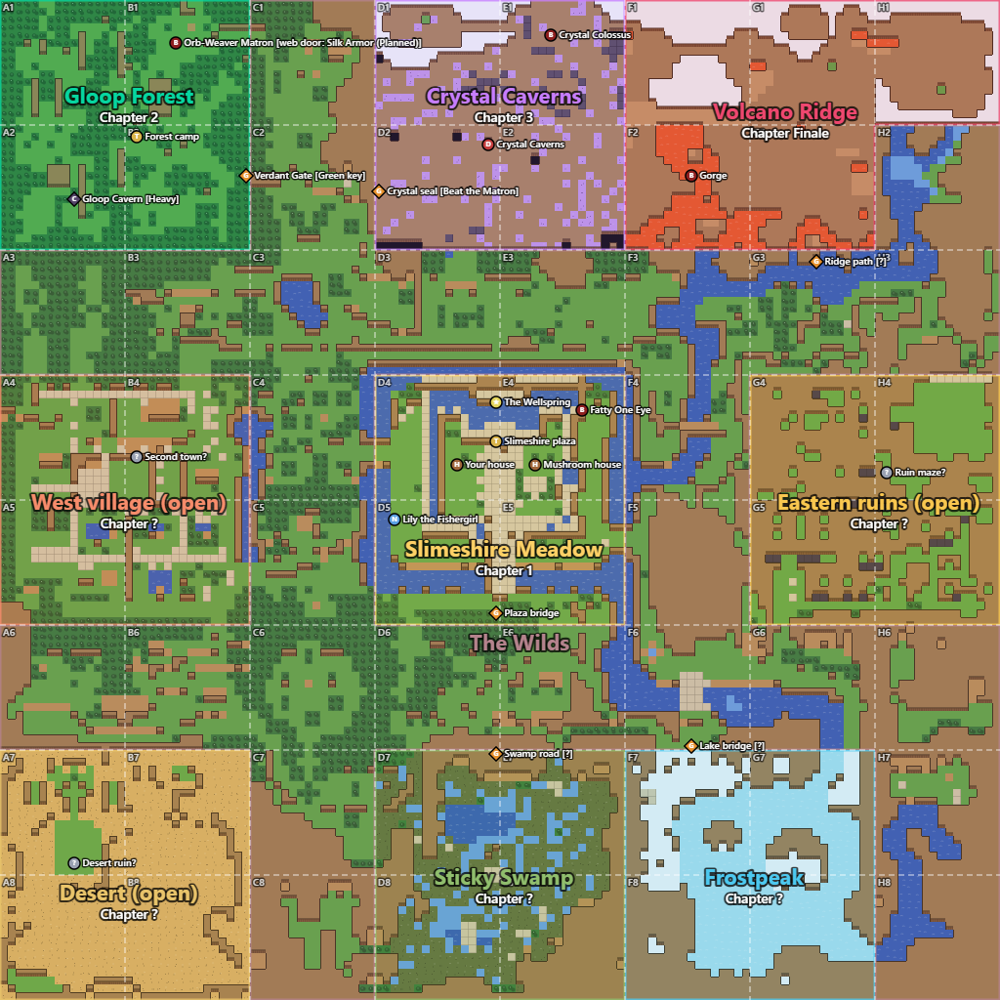

# World

Release 1's two regions are only the beginning. To feel like a Zelda world,
the game needs many more regions, and inside them dungeons, castles and mazes,
each with its own boss. This page lists what exists, what is sketched, and the
empty slots still to fill.

## Regions in order

| # | Region | Maps | Chapter | What has gone wrong (story) | Boss | Status |
|---|---|---|---|---|---|---|
| 1 | **Slimeshire Meadow** | `level-1`, `slime-home`, `mushroom-home` | 1 | Worms moved in, the smith fled, the Forge is cold and the Workshop is a ruin | Fatty One Eye | Built |
| 2 | **Gloop Forest** | `gloop-forest`, `gloop-hut`, `gloop-cavern` | 2 | The forest is choked with webs; the Matron's brood spreads | Orb-Weaver Matron | Built, in progress |
| 3 | **Crystal Caverns** | `crystal-caverns` (exists, locked) | 3 | Crystal grows over everything and has sealed the caves | Crystal Colossus | Idea, see the [sketch](chapters/chapter-3-crystal-caverns.md) |
| 4 | **Sticky Swamp** | none yet | ? | Slow mud, poison, rain, spider-slimes | ? | Idea |
| 5 | **Frostpeak** | `icege` is a candidate | ? | Ice physics and snow | ? | Idea |
| 6 | **Volcano Ridge** | `hot` and `emberleef` are candidates | Finale | Gorge's prison; the rumbling comes from here | Gorge | Idea / Proposal |

**Proposal: "What has gone wrong" always traces back to a Pearl.** It swelled
the boss, or it drove creatures out of their homes. This gives every region a
problem that the slime can actually fix.

**Open:** the order of regions 4 and 5, how many more regions the world needs,
and where castles and mazes fit. Zelda games have eight or more dungeons; at one
region per chapter, the world needs eight or more chapters.

## World size and screen

**Decided (2026-10-07):** the world is built on the grid of Zelda: A Link to
the Past's overworld (the reference is in `asset/Originals/MAPS/Maps/`:
`maps.md`, `zelda map.png` and `regions.png`). That world is 256 × 256 tiles,
cut into **8 × 8 chunks of 32 × 32 tiles**, and its regions are groups of
chunks: Kakariko Village, Hyrule Castle and the Lost Woods are 2 × 2 chunks
each, Death Mountain about 4 × 2.

| Unit | Tiles | Pixels (64 px tiles) |
|---|---|---|
| Tile | 1 | 64 × 64 |
| Screen | 16 × 14 | 1024 × 896 |
| Chunk | 32 × 32 (2 × 2.3 screens) | 2048 × 2048 |
| Region, usual size | 64 × 64 (2 × 2 chunks, 4 × 4.6 screens) | 4096 × 4096 |
| Whole overworld | 256 × 256 (8 × 8 chunks) | 16384 × 16384 |

Rules for every map:

1. **One tile is 64 × 64 px, and everything is sized in tiles.** The slime is
   about one tile, a tree 2 tiles wide and about 2.7 tall, a house 5 × 5.
2. **The screen shows 16 × 14 tiles**, as Zelda does. The game's base view is
   1024 × 896 px, and Godot scales it to fit the window: the view is never
   smaller than 16 × 14 tiles, and a wider window shows more columns (a 16:9
   window shows about 25 × 14). The menus and the HUD scale with it.
3. **An overworld map is a whole number of chunks**: its columns and rows are
   multiples of 32. A small area is one chunk (32 × 32), a region is usually
   2 × 2 chunks (64 × 64), and a large one, like Death Mountain, 4 × 2
   (128 × 64).
4. **The whole overworld is at most 8 × 8 chunks.** Each overworld map takes
   a place on that grid, and maps that touch on the grid connect through their
   shared edge.
5. **Interiors are not on the grid.** Houses, huts, caves and dungeons are their
   own maps. A room fits on one screen (16 × 14 tiles at most), as
   `slime-home` (14 × 11) and `mushroom-home` (16 × 12) already do; bigger
   caves and dungeons are made of whole screens.
6. **A map's edge is a wall** (forest, cliff or water, two or three tiles
   thick), broken only where an exit leads to the next map.

| Map | Size (tiles) | Chunks | Status |
|---|---|---|---|
| `level-1` (Slimeshire Meadow) | 64 × 64 | 2 × 2 | Follows the grid |
| `gloop-forest` | 54 × 54 | not whole | To resize to 64 × 64 |
| `crystal-caverns`, `icege`, `hot`, `emberleef` and the other candidates | 54 × 54 | not whole | To resize when they are used |
| `slime-home`, `mushroom-home`, `gloop-hut` | 14 × 11, 16 × 12, 14 × 11 | interior | Fit on one screen |
| `gloop-cavern` | 22 × 14 | interior | Two screens wide |

Each region's chunks (A1 in the north-west to H8 in the south-east) are in the
world map below. Slimeshire Meadow holds D4, E4, D5 and E5, so `level-1`'s
64 × 64 tiles are exactly those four chunks.

## World map

A rough sketch of the whole world: which region sits where, its ground and
hills, and what connects to what. It is drawn with the world map tool
(`pnpm story:map`, then open http://127.0.0.1:3210; see
[TOOLING](../TOOLING.md#story)), which saves the drawing to
[world-map.json](world-map.json), the picture to `world-map.png`, and rewrites
the block below. The sketch is 128 × 128 cells, so one cell is 2 × 2 tiles
and one chunk 16 × 16 cells. Its ground, water and cliffs were traced from the
A Link to the Past reference, and its regions take the reference's places:
Slimeshire in the middle (the castle's place), Gloop Forest in the north-west,
the Crystal Caverns and Volcano Ridge on the great mountain to the north,
Sticky Swamp and a frozen-lake Frostpeak to the south, three empty slots
(a west village, eastern ruins, a south-west desert), and **The Wilds**, the
connecting zones between them all. The layout is a **Proposal**.

<!-- world-map:start -->
<!-- Generated by the world map tool (pnpm story:map) from world-map.json. Draw on the map instead of editing this block. -->

The map is cut into 8 × 8 chunks, A1 in the north-west; a region's chunks are those where it holds most of the ground.

| Region | Chapter | Status | Chunks | Borders | Game maps | Boss | Notes |
|---|---|---|---|---|---|---|---|
| **Slimeshire Meadow** | 1 | Built | D4, E4, D5, E5 | The Wilds | level-1, slime-home, mushroom-home | Fatty One Eye | The hub, in the middle of the world (the castle's place in the reference): the plaza ringed by water. Worms moved in, the smith fled, the Forge is cold. |
| **Gloop Forest** | 2 | In progress | A1, B1, A2, B2 | The Wilds | gloop-forest, gloop-hut, gloop-cavern | Orb-Weaver Matron | North-west woods (the Lost Woods' place). Choked with webs; the Matron's brood spreads. |
| **Crystal Caverns** | 3 | Idea | D1, E1, D2, E2 | The Wilds, Volcano Ridge | crystal-caverns | Crystal Colossus | The west half of the great mountain, east of Gloop Forest: caves through the rock, crystal sealing them. First dungeon: a dark maze the Glow armor lights. |
| **Volcano Ridge** | Finale | Idea | F1, G1, H1, F2, G2 | Crystal Caverns, The Wilds | hot, emberleef (candidates) | Gorge | The east half of the great mountain, around the crater. Gorge's prison; the rumbling comes from here. |
| **Frostpeak** | ? | Idea | F7, G7, F8, G8 | The Wilds, Sticky Swamp | icege (candidate) |  | Proposal: the great lake in the south-east, frozen, with snowy cliffs: ice physics and snow. |
| **Sticky Swamp** | ? | Idea | D7, E7, D8, E8 | The Wilds, Frostpeak |  |  | South of the hub (the Great Swamp's place). Slow mud, poison, rain, spider-slimes. |
| **West village (open)** | ? | Idea | A4, B4, A5, B5 | The Wilds |  |  | Empty slot: a second town (Kakariko's place). Who lives here? |
| **Eastern ruins (open)** | ? | Idea | G4, H4, G5, H5 | The Wilds |  |  | Empty slot: a ruin maze on a plateau (the Eastern Palace's place). A dungeon region. |
| **Desert (open)** | ? | Idea | A7, B7, A8, B8 | The Wilds |  |  | Empty slot: a desert walled by cliffs (the Desert of Mystery's place). |
| **The Wilds** | ? | Idea | C1, C2, H2, A3, B3, C3, D3, E3, F3, G3, H3, C4, F4, C5, F5, A6, B6, C6, D6, E6, F6, G6, H6, C7, H7, C8, H8 | Gloop Forest, Crystal Caverns, Volcano Ridge, West village (open), Slimeshire Meadow, Eastern ruins (open), Desert (open), Sticky Swamp, Frostpeak |  |  | The connecting zones: the fields, roads, rivers and ledges between the regions. Every region opens onto them, so the hub reaches all of them. |

**Connections**

| Passage | Kind | Connects | Needs | Notes |
|---|---|---|---|---|
| Verdant Gate | Gate / passage | Gloop Forest ↔ The Wilds | Green key |  |
| Crystal seal | Gate / passage | Gloop Forest ↔ The Wilds | Beat the Matron | Reached from Gloop Forest's east road |
| Crystal seal | Gate / passage | Crystal Caverns ↔ The Wilds | Beat the Matron | Reached from Gloop Forest's east road |
| *none marked* | border | Crystal Caverns ↔ Volcano Ridge | | Open, or walled off? |
| Ridge path | Gate / passage | Volcano Ridge ↔ The Wilds | ? |  |
| *none marked* | border | West village (open) ↔ The Wilds | | Open, or walled off? |
| Plaza bridge | Gate / passage | Slimeshire Meadow ↔ The Wilds | nothing | The way out of Slimeshire into the Wilds |
| *none marked* | border | Eastern ruins (open) ↔ The Wilds | | Open, or walled off? |
| *none marked* | border | Desert (open) ↔ The Wilds | | Open, or walled off? |
| Swamp road | Gate / passage | Sticky Swamp ↔ The Wilds | ? |  |
| Lake bridge | Gate / passage | Frostpeak ↔ The Wilds | ? |  |
| *none marked* | border | Frostpeak ↔ Sticky Swamp | | Open, or walled off? |
| Crystal seal | Gate / passage | Gloop Forest ↔ Crystal Caverns | Beat the Matron | Reached from Gloop Forest's east road |
| Gloop Cavern | Cave / stairs | Gloop Forest → gloop-cavern | Heavy |  |

**Places on the map**

| Place | Kind | Region | Chunk | Needs | Notes |
|---|---|---|---|---|---|
| Crystal Caverns | Dungeon | Crystal Caverns | D2 |  |  |
| Crystal Colossus | Boss | Crystal Caverns | E1 |  |  |
| Desert ruin? | Note / idea | Desert (open) | A7 |  | Empty slot |
| Ruin maze? | Note / idea | Eastern ruins (open) | H4 |  | Empty slot: a dungeon |
| Forest camp | Town / hub | Gloop Forest | B2 |  |  |
| Orb-Weaver Matron | Boss | Gloop Forest | B1 | web door: Silk Armor (Planned) |  |
| Slimeshire plaza | Town / hub | Slimeshire Meadow | D4 |  | The middle of the world |
| The Wellspring | Landmark | Slimeshire Meadow | D4 |  | Proposal: plaza or clearing (Open) |
| Your house | House / interior | Slimeshire Meadow | D4 |  |  |
| Mushroom house | House / interior | Slimeshire Meadow | E4 |  |  |
| Lily the Fishergirl | NPC | Slimeshire Meadow | D5 |  | At the water around the plaza |
| Fatty One Eye | Boss | Slimeshire Meadow | E4 |  | Guards the chest with the green key |
| Gorge | Boss | Volcano Ridge | F2 |  | Finale, in the crater |
| Second town? | Note / idea | West village (open) | B4 |  | Empty slot |
<!-- world-map:end -->

## Slimeshire: the hub

Slimeshire is home. The slime comes back to it between chapters, and the town
grows as Pearls return.

| Place | What happens there | Status |
|---|---|---|
| The clearing | The slime's first steps; the first quests | Built |
| **The Wellspring** | The slime's birth; Pearls are returned here, and it brightens | Proposal (plaza or clearing: Open) |
| Elder Plop's path | The main-line giver for Chapter 1 | Built |
| **Your house** (the red forge house, its door leading to the Slime Home) | Bed: sleep to recover, and wake here after a defeat; the first vault | Built house; vault and quest Planned |
| Mushroom house | A furnished room with a bed and a chest | Built (role Open) |
| Forge yard, beside your house | The Forge, rebuilt in Chapter 2; smelting with a timer | Built; timer Planned |
| Workshop ruin, north of the plaza | Rebuilt after Chapter 2 | Built and parked |
| The lake | Lily the Fishergirl | Built |
| Worm camp, south-east | Worm Trouble | Built |
| Fatty One Eye's camp, east | The guarded chest with the green key | Built |
| The Verdant Gate, east | The way into Gloop Forest | Built |

## Gloop Forest

| Place | What happens there | Status |
|---|---|---|
| Forest camp (the walled clearing at the forest's heart) | Mossy, Sunny, a workbench, and the hut with a bed | Built |
| Weaver thickets | Orb-weavers and weaver fangs | Built |
| Iron hollow, south-east of the camp | Iron ore behind a gate opened by something heavy on its plate | Built |
| Silk nook, north-west | A walled nook behind a web | Built |
| Cracked clearing, south-west of the camp | Heavy breaks the ground; it drops into the Gloop Cavern | Built |
| **Gloop Cavern** | Today a chest, a Goo Heart and a ladder; Planned: the coffer with the 20-slot bag | Built; bag Planned |
| North stream | Sunny's basket and the lash bell post | Built |
| **The Matron's nest**, north-east | The boss arena; Planned: a **web door** closes it | Built; web door Planned |
| Crystal Caverns exit, east | Sealed with crystal: "Chapter 3" | Built (locked) |

## Webs (Planned)

The forest's webs are a wall, not a slowdown:

- A web blocks the path, and a slime that touches one is trapped in place.
- Only the **Silk Armor** passes through a web, and passing costs energy.
- The same rule applies to the Matron's special-attack webs, to some webs in
  spider camps, and to the **web door** in front of the Matron's camp.
- Webs that can only be passed with the Silk Armor are also good places to
  hide secrets in the regions the slime has already visited.

## Dungeons

None are built yet. **Proposal:** from Chapter 3 on, every region has at least
one dungeon (a cave, a castle or a maze) with three parts:

1. A first half that the slime can reach with what it already has.
2. The region's **key item** in the middle: an armor, a weapon or an ability.
3. A second half and a boss that both need that item.

The Crystal Caverns are the natural first dungeon: a dark maze that the Glow
armor lights.

## Secrets per map (Planned)

- **Four heart quarters per map** for now, and four quarters make one heart.
  **Open:** does the Gloop Cavern count as its own map, or does it share Gloop
  Forest's four?
- Some secrets should only open with items from later chapters, such as the
  Silk Armor, the Stone Armor roll or the Glow armor, so that going back pays
  off.
